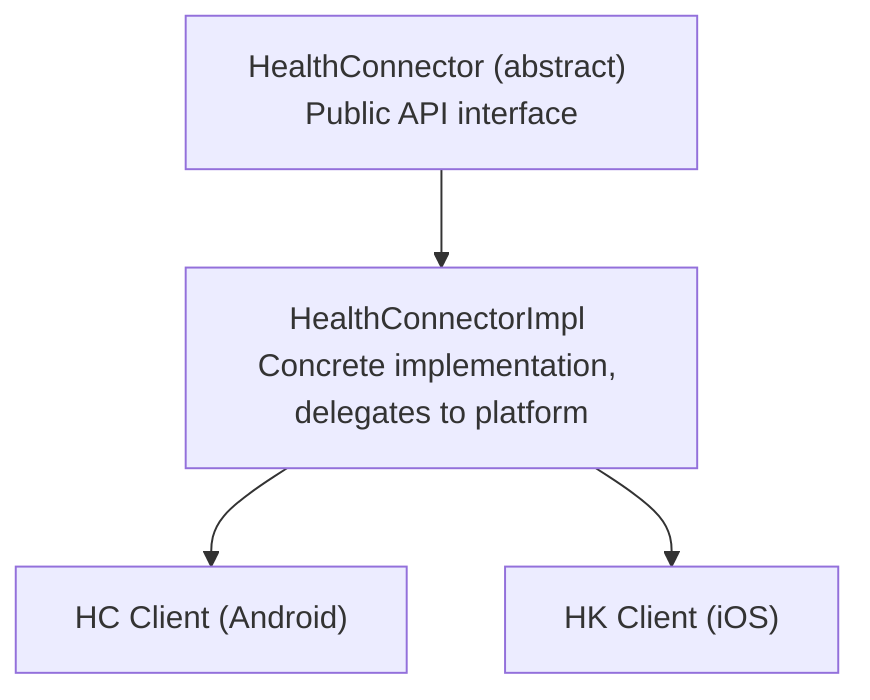

# CLAUDE.md

This file provides guidance to Claude Code (claude.ai/code) when working with code in this repository.

## Package Purpose

`health_connector` is the **main facade package** providing the unified public API for the Health Connector SDK.
It abstracts platform differences and provides a single entry point for developers to access health data from both
Android Health Connect and iOS HealthKit.

This is the package that end-users install via `pub.dev` and interact with in their Flutter applications.

## Directory Structure

```text
lib/
├── health_connector.dart          # Public API export
├── health_connector_internal.dart # Internal API export (for platform packages)
└── src/
    ├── health_connector.dart      # HealthConnector interface (1100+ lines)
    └── health_connector_impl.dart # Implementation delegating to platform clients
test/
└── unit_tests/
    ├── src/                       # Tests mirroring lib/src structure
    └── utils/                     # Test utilities
```

## Essential Commands

From this package directory:

```bash
# Run all tests
fvm flutter test

# Run specific test file
fvm flutter test test/unit_tests/src/health_connector_test.dart

# Analyze with fatal warnings
fvm dart analyze --fatal-warnings

# Format code
fvm dart format .
```

## Architecture

### Facade Pattern

This package implements the **Facade Pattern** to provide a unified interface across platforms:



### Two Library Entry Points

- **`health_connector.dart`**: Public API for end-users
  - Exports `health_connector_core` public API
  - Exports `health_connector_logger` (hides internal logger)
  - Exports `src/health_connector.dart` (main interface)

- **`health_connector_internal.dart`**: Internal API for platform implementations
  - Used by `health_connector_hc_android` and `health_connector_hk_ios`
  - Not intended for end-user consumption

## Key Patterns

### Factory Method Pattern

```dart
// Platform-agnostic creation
final connector = await HealthConnector.create(
  HealthConnectorConfig(isLoggerEnabled: true),
);

// Automatically selects:
// - HealthConnectorHKClient on iOS
// - HealthConnectorHCClient on Android
```

### Delegation Pattern

`HealthConnectorImpl` delegates all operations to the platform-specific client:

```dart
class HealthConnectorImpl implements HealthConnector {
  final HealthConnectorPlatformClient healthPlatformClient;

  @override
  Future<List<PermissionRequestResult>> requestPermissions(
    List<Permission> permissions,
  ) => healthPlatformClient.requestPermissions(permissions);

  // ... delegates all other methods
}
```

### Static Helper Methods

The interface provides static methods that don't require an instance:

- `HealthConnector.getHealthPlatformStatus()` - Check platform availability
- `HealthConnector.launchHealthAppPageInAppStore()` - Open app store (Android only)

## Package Dependencies

```yaml
dependencies:
  health_connector_core: ^3.7.0        # Domain models and abstractions
  health_connector_hc_android: ^3.4.0  # Android implementation
  health_connector_hk_ios: ^3.7.0      # iOS implementation
  health_connector_logger: ^4.0.0      # Logging utilities
```

> **Important**: This package has **no native code** (no `android/` or `ios/` directories). All native code lives in
> the platform-specific packages.

## Testing Patterns

- Uses `mocktail` for mocking platform clients
- Uses `parameterized_test` for data-driven tests
- Test structure mirrors `lib/src/` structure
- Mock injection via `HealthConnectorImpl` constructor

## API Surface

The `HealthConnector` interface provides 15 core methods:

**Setup & Status**:

- `create()` - Factory method (static)
- `getHealthPlatformStatus()` - Check availability (static)
- `launchHealthAppPageInAppStore()` - Open app store (static, Android only)

**Permissions**:

- `requestPermissions()` - Request health data access
- `getPermissionStatus()` - Check single permission
- `getGrantedPermissions()` - List all granted (Android only)
- `revokeAllPermissions()` - Revoke all (Android only)

**Features**:

- `getFeatureStatus()` - Check platform feature availability

**Data Operations**:

- `readRecord()` - Read single record by ID
- `readRecords()` - Query records in time range (paginated)
- `writeRecord()` - Write single record
- `writeRecords()` - Batch write (atomic)
- `deleteRecords()` - Delete by IDs or time range
- `aggregate()` - Compute sum/avg/min/max
- `synchronize()` - Incremental sync with change tracking

**Updates** (Android only):

- `updateRecord()` - Update single record
- `updateRecords()` - Batch update (atomic)
