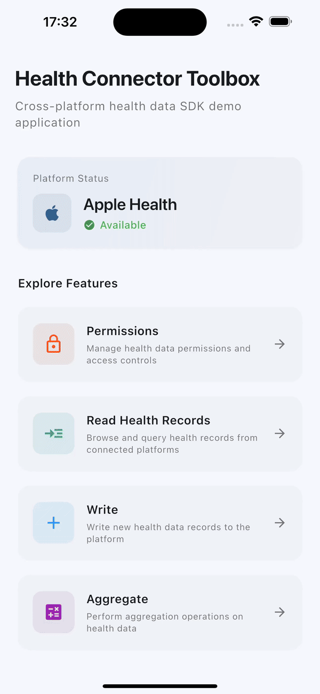
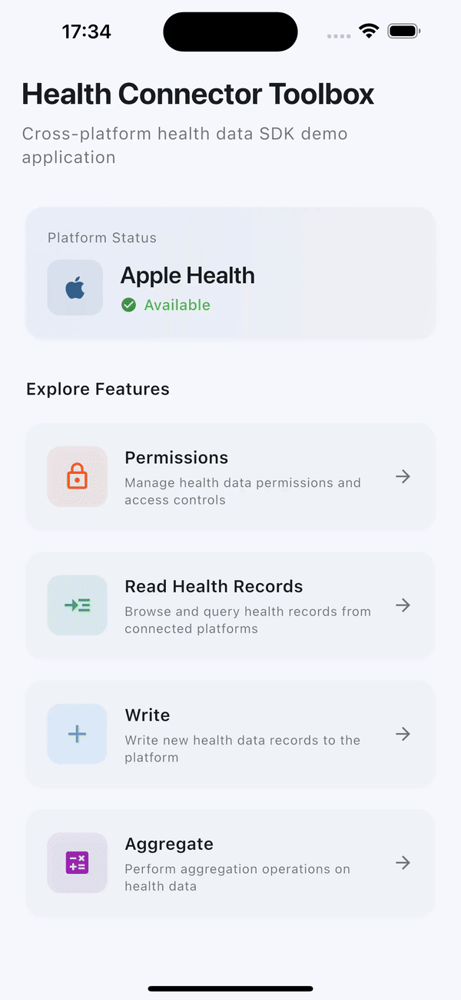
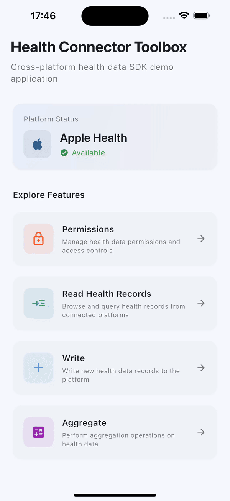
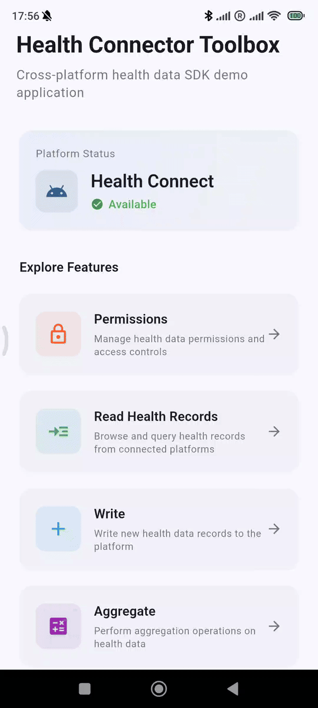
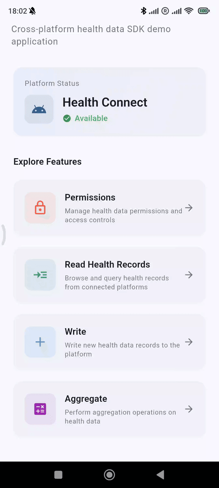
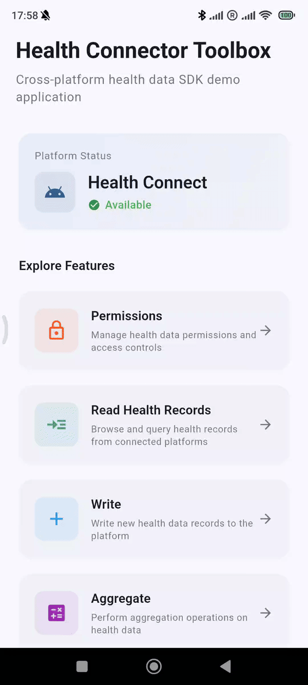
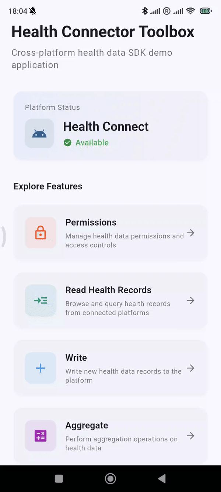

# health_connector

<p align="center">
  <a title="Pub" href="https://pub.dev/packages/health_connector"></a>
  <a title="Pub Points" href="https://pub.dev/packages/health_connector/score"></a>
  <a title="License" href="LICENSE"></a>
  
</p>

**Production-grade Flutter SDK for iOS HealthKit and Android Health
Connect.** Access **100+ health data types** with compile-time type safety,
incremental data synchronization, and privacy-first architecture.

---

## 📖 Table of Contents

- [⬆️ Migration Guide v2.x.x → v3.0.0](../../doc/guides/migration_guides/migration-guide-v2.x.x-to-v3.0.0.md)

- [🎮 See It In Action](#-see-it-in-action--interactive-toolbox-demo)

- [🚀 Quick Start](#-quick-start)
  - [📋 Requirements](#-requirements)
  - [📦 Installation](#-installation)
  - [🔧 Platform Setup](#-platform-setup)
  - [⚡ Quick Demo](#-quick-demo)

- [📘 Developer Guide](#-developer-guide)
  - [🔐 Manage Permissions](#-manage-permissions)
  - [📖 Read Data](#-read-data)
  - [💾 Write Data](#-write-data)
  - [🗑 Delete Data](#-delete-data)
  - [🔄 Update Data](#-update-data)
  - [➕ Aggregate Data](#-aggregate-data)
  - [🔁 Synchronize Data](#-synchronize-data)
  - [🔧 Manage Features](#-manage-features)
  - [🦺 Error Handling](#-error-handling)
  - [📝 Logging](#-logging)

- [📋 Supported Health Data Types](#-supported-health-data-types)

- [📚 References](#-references)
  - [⬆️ Migration Guides](#-migration-guides)
  - [🤝 Contributing](#-contributing)
  - [📄 License](#-license)

---

## 🎮 See It In Action — Interactive Toolbox Demo

**See what's possible.** The Health Connector Toolbox showcases the full
power of the SDK with live, interactive demonstrations running on both iOS
and Android.

<div align="center">
  <table>
    <tr>
      <th>🔐 Permissions</th>
      <th>📖 Read</th>
      <th>✍️ Write</th>
      <th>🗑 Delete</th>
      <th>📊 Aggregate</th>
    </tr>
    <tr>
      <td></td>
      <td></td>
      <td></td>
      <td></td>
      <td></td>
    </tr>
    <tr>
      <td></td>
      <td></td>
      <td></td>
      <td></td>
      <td></td>
    </tr>
  </table>
</div>

### 🚀 Try It Yourself

```bash
git clone https://github.com/fam-tung-lam/health_connector.git
cd health_connector/examples/health_connector_toolbox
flutter pub get && flutter run
```

> **Note:** The toolbox app is used only for demonstration purposes and as an internal tool for
> manually testing SDK features. It is not intended for production reference.

---

## 🚀 Quick Start

### 📋 Requirements

| Component   | Requirements                                        |
|-------------|-----------------------------------------------------|
| **Flutter** | • SDK: ≥3.35.7                                      |
| **Android** | • OS: API 26+<br>• Languages: Kotlin 2.1.0, Java 17 |
| **iOS**     | • OS: ≥15.0<br>• Language: Swift 5.9                |

> **✨ Upgrading is Easy:**
>
> - **Flutter 3.35.7** has great backward compatibility up to **Flutter
> 3.32.0**, making the migration very straightforward and requiring no
> changes to your existing code. For projects already using Material 3 UI,
> great backward compatibility extends up to **Flutter 3.27.0**.
>
> - **Swift 5.9** has great backward compatibility up to **Swift 5.0**, and
> **Kotlin 2.1** up to **Kotlin 2.0**. Migration is very straightforward —
> simply update version in your build configuration files. **No changes to
> your existing native code are required.**

### 📦 Installation

```bash
flutter pub add health_connector
```

Or add manually to `pubspec.yaml`:

```yaml
dependencies:
  health_connector: [ latest_version ]
```

### 🔧 Platform Setup

#### 🤖 Android Health Connect Setup

##### Step 1: Update AndroidManifest.xml

Update `Android/app/src/main/AndroidManifest.xml`:

```xml

<manifest xmlns:Android="http://schemas.Android.com/apk/res/Android">
    <application>
        <!-- Your existing configuration -->

        <!-- Health Connect intent filter for showing permissions rationale -->
        <activity-alias Android:name="ViewPermissionUsageActivity" Android:exported="true"
            Android:targetActivity=".MainActivity"
            Android:permission="Android.permission.START_VIEW_PERMISSION_USAGE">
            <intent-filter>
                <action Android:name="androidx.health.ACTION_SHOW_PERMISSIONS_RATIONALE" />
            </intent-filter>
        </activity-alias>
    </application>

    <!-- Declare Health Connect permissions for each data type you use -->

    <!-- Read permissions -->
    <uses-permission Android:name="Android.permission.health.READ_STEPS" />
    <uses-permission Android:name="Android.permission.health.READ_WEIGHT" />
    <uses-permission Android:name="Android.permission.health.READ_HEART_RATE" />
    <!-- Add more read permissions... -->

    <!-- Write permissions -->
    <uses-permission Android:name="Android.permission.health.WRITE_STEPS" />
    <uses-permission Android:name="Android.permission.health.WRITE_WEIGHT" />
    <uses-permission Android:name="Android.permission.health.WRITE_HEART_RATE" />
    <!-- Add more write permissions... -->

    <!-- Feature permissions -->
    <uses-permission Android:name="Android.permission.health.READ_HEALTH_DATA_IN_BACKGROUND" />
    <uses-permission Android:name="Android.permission.health.READ_HEALTH_DATA_HISTORY" />
    <!-- Add more feature permissions... -->
</manifest>
```

> **❗ Important**: You must declare a permission for *each* health data type and feature your app
> accesses.
> See
>
the [Health Connect data types list](https://developer.android.com/health-and-fitness/guides/health-connect/plan/data-types)
> for all available permissions.

##### Step 2: Update MainActivity (Android 14+)

This SDK uses the modern `registerForActivityResult` API when requesting
permissions from Health Connect. For this to work correctly, your app's
`MainActivity` must extend `FlutterFragmentActivity` instead of
`FlutterActivity`.

Update `Android/app/src/main/Kotlin/.../MainActivity.kt`:

```kotlin
package com.example.yourapp

import io.Flutter.embedding.Android.FlutterFragmentActivity

class MainActivity : FlutterFragmentActivity() {
    // Your existing code
}
```

##### Step 3: Enable AndroidX

Health Connect is built on AndroidX libraries. `Android.useAndroidX=true`
enables AndroidX support, and `Android.enableJetifier=true` automatically
migrates third-party libraries to use AndroidX.

Update `Android/gradle.properties`:

```properties
# Your existing configuration
Android.enableJetifier=true
Android.useAndroidX=true
```

##### Step 4: Set Minimum Android Version

Health Connect requires Android 8.0 (API 26) or higher.

Update `Android/app/build.gradle`:

```gradle
Android {
    // Your existing configuration

    defaultConfig {
        // Your existing configuration

        minSdkVersion 26  // Required for Health Connect
    }
}
```

#### 🍎 iOS HealthKit Setup

##### Step 1: Configure Xcode

1. Open your project in Xcode (`iOS/Runner.xcworkspace`)
2. Select your app target
3. In **General** tab → Set **Minimum Deployments** to **15.0**
4. In **Signing & Capabilities** tab → Click **+ Capability** → Add **HealthKit**

##### Step 2: Update Info.plist

Add to `iOS/Runner/Info.plist`:

```xml

<dict>
    <!-- Existing keys -->

    <!-- Required: Describe why your app reads health data -->
    <key>NSHealthShareUsageDescription</key>
    <string>This app needs to read your health data to provide personalized insights.</string>

    <!-- Required: Describe why your app writes health data -->
    <key>NSHealthUpdateUsageDescription</key>
    <string>This app needs to save health data to track your progress.</string>
</dict>
```

> **🦺 Warning**: Vague or generic usage descriptions may result in App Store rejection.
> Be specific about *what* data you access and *why*.

### ⚡ Quick Demo

```dart
import 'package:health_connector/health_connector.Dart';

Future<void> quickStart() async {
  // 1. Check platform availability
  final status = await HealthConnector.getHealthPlatformStatus();
  if (status != HealthPlatformStatus.available) {
    print('Health platform not available: $status');
    return;
  }

  // 2. Create connector instance
  final connector = await HealthConnector.create(
    const HealthConnectorConfig(
      loggerConfig: HealthConnectorLoggerConfig(
        logProcessors: [PrintLogProcessor()],
      ),
    ),
  );

  // 3. Request permissions
  final results = await connector.requestPermissions([
    HealthDataType.steps.readPermission,
    HealthDataType.steps.writePermission,
  ]);

  // 4. Verify permissions were granted
  final granted = results.every((r) => r.status != PermissionStatus.denied);
  if (!granted) {
    print('Permissions denied');
    return;
  }

  // 5. Write health data
  final now = DateTime.now();
  final records = [
    StepsRecord(
      id: HealthRecordId.none,
      startTime: now.subtract(Duration(hours: 3)),
      endTime: now.subtract(Duration(hours: 2)),
      count: Number(1500),
      metadata: Metadata.automaticallyRecorded(
        device: Device.fromType(DeviceType.phone),
      ),
    ),
    StepsRecord(
      id: HealthRecordId.none,
      startTime: now.subtract(Duration(hours: 2)),
      endTime: now.subtract(Duration(hours: 1)),
      count: Number(2000),
      metadata: Metadata.automaticallyRecorded(
        device: Device.fromType(DeviceType.phone),
      ),
    ),
  ];

  final recordIds = await connector.writeRecords(records);
  print('Wrote ${recordIds.length} records');

  // 6. Read health data
  final response = await connector.readRecords(
    HealthDataType.steps.readInTimeRange(
      startTime: now.subtract(Duration(days: 1)),
      endTime: now,
    ),
  );

  print('Found ${response.records.length} records:');
  for (final record in response.records) {
    print(
      '  → ${record.count.value} steps (${record.startTime}-${record.endTime})',
    );
  }

  // 7. Aggregate health data
  final totalSteps = await connector.aggregate(
    HealthDataType.steps.aggregateSum(
      startTime: now.subtract(Duration(days: 1)),
      endTime: now,
    ),
  );
  print('Total steps: ${totalSteps.value.value}');

  // 8. Delete health data
  await connector.deleteRecords(HealthDataType.steps.deleteByIds(recordIds));
  print('Deleted ${recordIds.length} records');
}
```

> **What's Next?**
>
> - Check out the [Developer Guide](#-developer-guide) for full API
>   documentation, error handling, and advanced features.
> - Check out the [Supported Health Data Types](#-supported-health-data-types).

---

## 📘 Developer Guide

### 🔐 Manage Permissions

#### Check Permission Status

> **iOS Privacy:** HealthKit purposefully restricts access to read
> authorization status to protect user privacy. The SDK explicitly exposes
> this platform behavior by returning `unknown` for all iOS read
> permissions. This is a native privacy feature, not an SDK limitation.

```dart
final status = await connector.getPermissionStatus(
  HealthDataType.steps.readPermission,
);

switch (status) {
  case PermissionStatus.granted:
    print('Steps read permission granted');
  case PermissionStatus.denied:
    print('Steps read permission denied');
  case PermissionStatus.unknown:
    print('Steps read permission unknown (iOS read)');
}
```

#### Workaround: Detecting iOS Read Status

> **Disclaimer:** This workaround attempts to infer permission status, which
> bypasses HealthKit's intended privacy design. Use only if your app
> genuinely needs to determine read permission status.

Since iOS returns `unknown` for read permissions, you can infer the status
by attempting a minimal read operation. If the read fails with
`AuthorizationException`, permission is definitively denied.

```dart
Future<bool> hasReadPermission(HealthDataType dataType) async {
  try {
    // Attempt to read a single record to check access
    await connector.readRecords(
      dataType.readInTimeRange(
        startTime: DateTime.now().subtract(Duration(days: 1)),
        endTime: DateTime.now(),
        pageSize: 1, // Minimize data transfer
      ),
    );
    return true; // Read succeeded (or returned empty) -> Permission granted
  } on AuthorizationException {
    return false; // Explicitly denied
  }
}
```

#### Request Permissions

```dart
// 1. Define permissions to request
final permissions = [
  HealthDataType.steps.readPermission,
  HealthDataType.steps.writePermission,
  HealthDataType.weight.readPermission,
  HealthPlatformFeature.readHealthDataInBackground.permission,
];

// 2. Request permissions
final results = await connector.requestPermissions(permissions);

// 3. Process results
for (final result in results) {
  switch (result.status) {
    case PermissionStatus.granted:
      print('Granted: ${result.permission}');
    case PermissionStatus.denied:
      print('Denied: ${result.permission}');
    case PermissionStatus.unknown:
      print('Unknown: ${result.permission} (iOS read permission)');
  }
}
```

#### Get All Granted Permissions (Android Health Connect only)

> **iOS Privacy:** HealthKit does not allow apps to enumerate granted
> permissions, preventing user fingerprinting. This API throws
> `UnsupportedOperationException` on iOS.

```dart
try {
  final grantedPermissions = await connector.getGrantedPermissions();
  for (final permission in grantedPermissions) {
    print(
      'Granted: ${permission.dataType} (${permission.accessType})',
    ); // Example: ✅ Granted: HealthDataType.steps (read)
  }
} on UnsupportedOperationException {
  print('Listing granted permissions is not supported on iOS');
}
```

#### Revoke All Permissions (Android Health Connect only)

> **iOS Privacy:** HealthKit does not support programmatic permission revocation. Users must manage
> permissions in the iOS Settings app. This API throws `UnsupportedOperationException` on iOS.

```dart
try {
  await connector.revokeAllPermissions();
  print('Permissions revoked');
} on UnsupportedOperationException {
  print('Programmatic revocation is not supported on iOS');
}
```

### 📖 Read Data

> **Historical Data Access:**
>
> - Android Health Connect defaults to 30 days—request
    `HealthPlatformFeature.readHealthDataHistory` permission for older data.
> - iOS HealthKit has no restrictions for historical data access.

#### Read by ID

```dart
// 1. Define read request
final readRequest = HealthDataType.steps.readById(
  HealthRecordId('record-id'),
);

// 2. Process read request
final record = await connector.readRecord(readRequest);

// 3. Process result
if (record != null) {
  print('Found: ${record.count.value} steps');
} else {
  print('No record found.');
}
```

#### Read by Time Range

```dart
// 1. Define read request
final readRequest = HealthDataType.steps.readInTimeRange(
  startTime: DateTime.now().subtract(Duration(days: 7)),
  endTime: DateTime.now(),
);

// 2. Process read request
final response = await connector.readRecords(readRequest);

// 3. Process result
print('Found ${response.records.length} records');
for (final record in response.records) {
  print('${record.count.value} steps on ${record.startTime}');
}
```

#### Sort Records by Time

```dart
// Sort oldest first (ascending)
final oldestFirst = await connector.readRecords(
  HealthDataType.steps.readInTimeRange(
    startTime: DateTime.now().subtract(Duration(days: 7)),
    endTime: DateTime.now(),
    sortDescriptor: SortDescriptor.timeAscending,
  ),
);

// Sort newest first (descending) - default behavior
final newestFirst = await connector.readRecords(
  HealthDataType.steps.readInTimeRange(
    startTime: DateTime.now().subtract(Duration(days: 7)),
    endTime: DateTime.now(),
    sortDescriptor: SortDescriptor.timeDescending, // Default
  ),
);
```

#### Paginate Through All Records

```dart
// 1. Create read request with configured page size
var request = HealthDataType.steps.readInTimeRange(
  startTime: DateTime.now().subtract(Duration(days: 30)),
  endTime: DateTime.now(),
  pageSize: 100,
);

// 2. Fetch all pages
final allRecords = <StepsRecord>[];
while (true) {
  final response = await connector.readRecords(request);
  allRecords.addAll(response.records.cast<StepsRecord>());

  // Check if there are more pages
  if (response.nextPageRequest == null) {
    print('No more pages');

    break;
  }

  print('Fetching next page...');
  request = response.nextPageRequest!;
}

// 3. Print total records
print('Total: ${allRecords.length} records');
```

### 💾 Write Data

#### Write Single Record

```dart
// 1. Create record
final record = StepsRecord(
  // `id` must be `HealthRecordId.none` for new records
  id: HealthRecordId.none,
  startTime: DateTime.now().subtract(Duration(hours: 1)),
  endTime: DateTime.now(),
  count: Number(5000),
  metadata: Metadata.automaticallyRecorded(
    device: Device.fromType(DeviceType.phone),
  ),
);

// 2. Write record
final recordId = await connector.writeRecord(record);
print('Saved: $recordId');
```

#### Batch Write Multiple Records

```dart
final now = DateTime.now();

// 1. Create records
final records = [
  StepsRecord(
    id: HealthRecordId.none,
    startTime: now.subtract(Duration(hours: 3)),
    endTime: now.subtract(Duration(hours: 2)),
    count: Number(1500),
    metadata: Metadata.automaticallyRecorded(
      device: Device.fromType(DeviceType.phone),
    ),
  ),
  WeightRecord(
    id: HealthRecordId.none,
    time: now.subtract(Duration(hours: 1)),
    weight: Mass.fromKilograms(70.5),
    metadata: Metadata.automaticallyRecorded(
      device: Device.fromType(DeviceType.phone),
    ),
  ),
  HeightRecord(
    id: HealthRecordId.none,
    time: now,
    height: Length.fromMeters(1.75),
    metadata: Metadata.automaticallyRecorded(
      device: Device.fromType(DeviceType.phone),
    ),
  ),
];

// 2. Write records (atomic operation—all succeed or all fail)
final ids = await connector.writeRecords(records);
print('Wrote ${ids.length} records');
```

### 🗑 Delete Data

> **Note:** Apps can only delete records they created—this is a platform security restriction.
> Attempting to delete records created by other apps will throw an `AuthorizationException`.

#### Delete by IDs

```dart
// 1. Define delete request
final request = HealthDataType.steps.deleteByIds([
  HealthRecordId('id-1'),
  HealthRecordId('id-2'),
]);

// 2. Delete specific steps records by IDs (atomic operation—all succeed or all fail)
await connector.deleteRecords(request);
print('Deleted');
```

#### Delete by Time Range

```dart
// 1. Define delete request
final request = HealthDataType.steps.deleteInTimeRange(
  startTime: DateTime.now().subtract(Duration(days: 7)),
  endTime: DateTime.now(),
);

// 2. Delete all steps records created in the past week (atomic
// operation—all succeed or all fail)
await connector.deleteRecords(request);
```

### 🔄 Update Data

> **iOS Limitation:** HealthKit uses an immutable data model—records cannot be updated, only deleted
> and recreated. This is a platform security restriction.

#### Update Single Record (Android Health Connect only)

```dart
// 1. Fetch record to update
final record = await connector.readRecord(
  HealthDataType.steps.readById(HealthRecordId('record-id')),
);

// 2. Update record value
await connector.updateRecord(
  record.copyWith(count: Number(record.count.value + 500)),
);
print('Record updated');
```

#### iOS Workaround: Delete + Recreate

```dart
// 1. Delete existing record
await connector.deleteRecords(
  HealthDataType.steps.deleteByIds([existingRecord.id]),
);

// 2. Change record value
final newRecord = existingRecord.copyWith(
  id: HealthRecordId.none,
  count: Number(newValue),
);

// 3. Write new record with updated value
final newId = await connector.writeRecord(
  newRecord,
); // 🦺 Note: ID changes after recreation
```

#### Batch Update (Android Health Connect only)

```dart
// 1. Fetch records to update
final response = await connector.readRecords(
  HealthDataType.steps.readInTimeRange(
    startTime: DateTime.now().subtract(Duration(days: 7)),
    endTime: DateTime.now(),
  ),
);

// 2. Apply changes
final updated = response.records
    .map((r) => r.copyWith(count: Number(r.count.value + 100)))
    .toList();

// 3. Update records (atomic operation—all succeed or all fail)
await connector.updateRecords(updated);
print('Updated ${updated.length} records');
```

### ➕ Aggregate Data

```dart
final now = DateTime.now();
final thirtyDaysAgo = now.subtract(Duration(days: 30));

// Calculate total steps for the past 30 days
final sumResult = await connector.aggregate(
  HealthDataType.steps.aggregateSum(
    startTime: thirtyDaysAgo,
    endTime: now,
  ),
);
print('Total steps: ${sumResult.value}');

// Calculate average weight for the past 30 days
final avgResult = await connector.aggregate(
  HealthDataType.weight.aggregateAvg(
    startTime: thirtyDaysAgo,
    endTime: now,
  ),
);
print('Average weight: ${avgResult.inKilograms} kg');

// Calculate minimum weight for the past 30 days
final minResult = await connector.aggregate(
  HealthDataType.weight.aggregateMin(
    startTime: thirtyDaysAgo,
    endTime: now,
  ),
);
print('Minimum weight: ${minResult.inKilograms} kg');

// Calculate maximum weight for the past 30 days
final maxResult = await connector.aggregate(
  HealthDataType.weight.aggregateMax(
    startTime: thirtyDaysAgo,
    endTime: now,
  ),
);
print('Maximum weight: ${maxResult.inKilograms} kg');
```

### 🔁 Synchronize Data

Data synchronization is an **incremental sync API** that retrieves **only
health data that has changed since your last sync**, dramatically reducing
bandwidth usage and improving performance for apps that need to stay
up-to-date with health data.

#### When to Use Sync vs Regular Reads

| Use Case                                                        | Recommended Approach   |
| :-------------------------------------------------------------- | :--------------------- |
| **Periodic background sync** (e.g., daily health data updates)  | ✅ Use `synchronize()` |
| **Real-time monitoring** of ongoing activity                    | ✅ Use `synchronize()` |
| **One-time data fetch** for a specific time range               | Use `readRecords()`    |
| **User-requested historical data** (e.g., "show me last month") | Use `readRecords()`    |

#### How Synchronization Works

Synchronization follows a **two-phase flow**:

1. **Phase 1: Set Checkpoint** (one-time setup)
    - Call `synchronize()` with `syncToken: null`
    - This establishes a point-in-time marker (no data is returned)
    - Save the returned `nextSyncToken` for later use

2. **Phase 2: Fetch Changes** (repeated syncs)
    - Call `synchronize()` with your saved `syncToken`
    - Receive only records that changed since that token was created
        - **Upserted records**: New or updated records since last sync
        - **Deleted record IDs**: Records that were deleted since last sync
    - Always save the new `nextSyncToken` to continue tracking changes

#### Example: Complete Sync Flow

```dart
import 'package:health_connector/health_connector.Dart';

// Use SharedPreferences, secure storage, or your preferred persistence layer
final storage = LocalTokenStorage();

// Step 1: Set Initial Checkpoint
Future<void> setupSyncCheckpoint() async {
  final connector = await HealthConnector.create();

  // Pass null to establish "now" as the starting synchronization point
  final result = await connector.synchronize(
    dataTypes: [HealthDataType.steps, HealthDataType.heartRate],
    syncToken: null,
  );

  // Save token for future syncs
  await storage.saveToken(result.nextSyncToken.toJson());
  print('Sync checkpoint established');
}

// Step 2: Fetch Changes Since Last Sync
Future<void> syncHealthData() async {
  final connector = await HealthConnector.create();

  // Load saved token
  final tokenJson = await storage.loadToken();
  if (tokenJson == null) {
    print('No checkpoint found. Run setupSyncCheckpoint() first.');
    return;
  }

  final token = HealthDataSyncToken.fromJson(tokenJson);

  // Fetch changes since the token was created
  final result = await connector.synchronize(
    dataTypes: [HealthDataType.steps, HealthDataType.heartRate],
    syncToken: token, // Use saved token
  );

  print('Sync results:');
  print('  • New/updated records: ${result.upsertedRecords.length}');
  print('  • Deleted record IDs: ${result.deletedRecordIds.length}');

  // Process upserted records (new or modified)
  for (final record in result.upsertedRecords) {
    print('Upserted record: $record');
  }

  // Process deletions
  for (final id in result.deletedRecordIds) {
    print('Deleted record ID: $id');
  }

  // IMPORTANT: Always save the new token for the next sync
  await storage.saveToken(result.nextSyncToken.toJson());
  print('Sync complete');
}
```

#### Handling Pagination

When there are many changes, results are **paginated automatically**. Use
`hasMore` to detect
pagination and fetch all pages in a loop:

```dart
Future<void> syncAllPages() async {
  final connector = await HealthConnector.create();
  
  // Load sync token from storage
  final tokenJson = await storage.loadToken();
  if (tokenJson == null) {
    print('No checkpoint found');
    return;
  }

  var token = HealthDataSyncToken.fromJson(tokenJson);
  final allUpsertedRecords = <HealthRecord>[];
  final allDeletedRecordIds = <HealthRecordId>[];

  // Fetch all pages until hasMore is false
  do {
    final result = await connector.synchronize(
      dataTypes: [HealthDataType.steps],
      syncToken: token,
    );

    allUpsertedRecords.addAll(result.upsertedRecords);
    allDeletedRecordIds.addAll(result.deletedRecordIds);

    // Update token for next page
    token = result.nextSyncToken;

    print('Fetched page with:');
    print('  • New/updated records: ${result.upsertedRecords.length}');
    print('  • Deleted record IDs: ${result.deletedRecordIds.length}');
  } while (result.hasMore);

  // Process all changes together
  print('Sync results:');
  print('  • New/updated records: ${allUpsertedRecords.length}');
  print('  • Deleted record IDs: ${allDeletedRecordIds.length}');

  // Save the final token for the next synchronization
  await storage.saveToken(token.toJson());
}
```

### 🔧 Manage Features

#### Check Feature Availability

```dart
final status = await connector.getFeatureStatus(
  HealthPlatformFeature.readHealthDataInBackground,
);

if (status == HealthPlatformFeatureStatus.available) {
  await connector.requestPermissions([
    HealthPlatformFeature.readHealthDataInBackground.permission,
  ]);
  print('Feature available and requested');
} else {
  print('Feature not available—implement fallback');
}
```

> **Note:** All features are built directly into the OS and are always
> available. On Android, Health Connect features may vary depending on the
> installed app and Android version. Use `getFeatureStatus()` to verify
> feature support on the user's device before requesting permissions.

### 🦺 Error Handling

Every `HealthConnectorException` thrown by the SDK includes a
`HealthConnectorErrorCode` that provides specific details about what went
wrong. Use this code to handle errors programmatically.

| Error Code                                  | Exception Type                      | Platform | Description & Causes                                                                                                            | Recovery Strategy                                                             |
|:--------------------------------------------|:------------------------------------|:---------|:--------------------------------------------------------------------------------------------------------------------------------|:------------------------------------------------------------------------------|
| `permissionNotGranted`                      | `AuthorizationException`            | Both     | Permission denied, revoked, or not determined.                                                                                  | Request permissions or guide user to settings.                                |
| `permissionNotDeclared`                     | `ConfigurationException`            | All      | Missing required permission in `AndroidManifest.xml` or `Info.plist`.                                                           | **Developer Error:** Add missing permissions to your app configuration.       |
| `healthServiceUnavailable`                  | `HealthServiceUnavailableException` | All      | Device doesn't support Health Connect (Android) or HealthKit (iPad).                                                            | Check `getHealthPlatformStatus()`. Gracefully disable health features.        |
| `healthServiceRestricted`                   | `HealthServiceUnavailableException` | All      | Health data access restricted by system policy (e.g. parental controls).                                                        | Gracefully disable health features and inform the user.                       |
| `healthServiceNotInstalledOrUpdateRequired` | `HealthServiceUnavailableException` | Android  | Health Connect app is missing or needs an update.                                                                               | Prompt user to install/update via `launchHealthAppPageInAppStore()`.          |
| `healthServiceDatabaseInaccessible`         | `HealthServiceException`            | iOS      | Device is locked and health database is encrypted/inaccessible.                                                                 | Wait for device unlock or notify user to unlock their device.                 |
| `ioError`                                   | `HealthServiceException`            | Android  | Device storage I/O failed while reading/writing records.                                                                        | Retry operation with exponential backoff.                                     |
| `remoteError`                               | `HealthServiceException`            | Android  | IPC communication with the underlying health service failed.                                                                    | Retry operation; usually a temporary system glitch.                           |
| `rateLimitExceeded`                         | `HealthServiceException`            | Android  | API request quota exhausted.                                                                                                    | Wait and retry later. Implement exponential backoff.                          |
| `dataSyncInProgress`                        | `HealthServiceException`            | Android  | Health Connect is currently syncing data; operations locked.                                                                    | Retry after a short delay.                                                    |
| `invalidArgument`                           | `InvalidArgumentException`          | All      | Invalid parameter, malformed record, or expired usage of a token.                                                               | Validate input. For expired sync tokens, restart sync with `syncToken: null`. |
| `unsupportedOperation`                      | `UnsupportedOperationException`     | All      | The requested operation is not supported on the current platform or OS version (e.g. accessing Android-only data types on iOS). | Check `@supportedOn` annotations in documentation before using the API.       |
| `unknownError`                              | `UnknownException`                  | All      | An unclassified internal system error occurred.                                                                                 | Log the error details for debugging.                                          |

#### Example: Error Handling

```dart
try {
  await connector.writeRecord(record);
} on AuthorizationException catch (e) {
  print('Authorization failed: ${e.message}');
} on HealthServiceUnavailableException catch (e) {
  print('Health service unavailable: ${e.code}');
} on HealthServiceException catch (e) {
  switch (e.code) {
    case HealthConnectorErrorCode.rateLimitExceeded:
      print('Rate limit exceeded. Retrying in 5s...');
      break;

    case HealthConnectorErrorCode.dataSyncInProgress:
      print('Health Connect is busy syncing... Retrying later...');
      break;

    case HealthConnectorErrorCode.remoteError:
    case HealthConnectorErrorCode.ioError:
      print('Temporary system glitches. Retrying later...');
      break;

    default:
      print('Health Service Warning: ${e.message}');
      break;
  }
} on InvalidArgumentException catch (e) {
  print('Invalid data or expired token: ${e.message}');
} catch (e, stack) {
  print('Unexpected system error: $e');
}
```

### 📝 Logging

Health data is sensitive, and user privacy is paramount. The Health
Connector SDK adopts a **strict zero-logging policy by default**:

- **No Internal Logging**: The SDK never writes to `print`, `stdout`, or
  platform logs (Logcat/Console) on its own.
- **Full Control**: You decide exactly where logs go. Even low-level logs
  from native Swift/Kotlin code are routed through to Dart, giving you a
  single control plane for all SDK activity.
- **Compliance Ready**: This architecture ensures no sensitive data is
  accidentally logged, making it easier to comply with privacy regulations
  (GDPR, HIPAA) and pass security reviews.

The system is configured via `HealthConnectorLoggerConfig`, where you define a list of
`logProcessors`. Each processor handles logs independently and asynchronously.

#### Setup with Built-in Processors

```dart
// Configure logging with built-in processors
final connector = await HealthConnector.create(
  const HealthConnectorConfig(
    loggerConfig: HealthConnectorLoggerConfig(
      enableNativeLogging: false, // Optional: forward native Kotlin/Swift logs
      logProcessors: [
        // Print warnings and errors to console
        PrintLogProcessor(
          levels: [
            HealthConnectorLogLevel.warning,
            HealthConnectorLogLevel.error,
          ],
        ),

        // Send all logs to Dart:developer (integrates with DevTools)
        DeveloperLogProcessor(
          levels: HealthConnectorLogLevel.values,
        ),
      ],
    ),
  ),
);
```

#### Custom Processor Example

Create your own processor for custom logging needs:

```dart
// Example: File logging processor
class FileLogProcessor extends HealthConnectorLogProcessor {
  final File logFile;

  const FileLogProcessor({
    required this.logFile,
    super.levels = HealthConnectorLogLevel.values,
  });

  @override
  Future<void> process(HealthConnectorLog log) async {
    try {
      final formatted = '${log.dateTime} [${log.level.name.toUpperCase()}] '
          '${log.message}\n';
      await logFile.writeAsString(formatted, mode: FileMode.append);
    } catch (e) {
      // Handle errors gracefully
      debugPrint('Failed to write log: $e');
    }
  }

  @override
  bool shouldProcess(HealthConnectorLog log) {
    // Custom filtering logic
    return super.shouldProcess(log) &&
        log.level == HealthConnectorLogLevel.error;
  }
}

// Use custom processor
final connector = await HealthConnector.create(
  HealthConnectorConfig(
    loggerConfig: HealthConnectorLoggerConfig(
      logProcessors: [
        FileLogProcessor(logFile: File('/path/to/app.log')),
      ],
    ),
  ),
);
```

---

## 📋 Supported Health Data Types

### 🏃 Activity

#### General Activity

| Data Type            | Description                                  | Data Type                               | Supported Aggregation | Supported On                          | Android Health Connect API                                                                                                                         | iOS HealthKit API                                                                                                                                |
|:---------------------|:---------------------------------------------|:----------------------------------------|:----------------------|:--------------------------------------|:---------------------------------------------------------------------------------------------------------------------------------------------------|:-------------------------------------------------------------------------------------------------------------------------------------------------|
| Steps                | Number of steps taken                        | `HealthDataType.steps`                  | Sum                   | Android Health Connect, iOS HealthKit | [StepsRecord](https://developer.android.com/reference/kotlin/androidx/health/connect/client/records/StepsRecord)                                   | [HKQuantityTypeIdentifier.stepCount](https://developer.apple.com/documentation/healthkit/hkquantitytypeidentifier/stepcount)                     |
| Active Energy Burned | Energy burned through active movement        | `HealthDataType.activeEnergyBurned`     | Sum                   | Android Health Connect, iOS HealthKit | [ActiveEnergyBurnedRecord](https://developer.android.com/reference/kotlin/androidx/health/connect/client/records/ActiveEnergyBurnedRecord)         | [HKQuantityTypeIdentifier.activeEnergyBurned](https://developer.apple.com/documentation/healthkit/hkquantitytypeidentifier/activeenergyburned)   |
| Floors Climbed       | Number of floors (flights of stairs) climbed | `HealthDataType.floorsClimbed`          | Sum                   | Android Health Connect, iOS HealthKit | [FloorsClimbedRecord](https://developer.android.com/reference/kotlin/androidx/health/connect/client/records/FloorsClimbedRecord)                   | [HKQuantityTypeIdentifier.flightsClimbed](https://developer.apple.com/documentation/healthkit/hkquantitytypeidentifier/flightsclimbed)           |
| Sexual Activity      | Sexual activity tracking                     | `HealthDataType.sexualActivity`         | -                     | Android Health Connect, iOS HealthKit | [SexualActivityRecord](https://developer.android.com/reference/kotlin/androidx/health/connect/client/records/SexualActivityRecord)                 | [HKCategoryTypeIdentifier.sexualActivity](https://developer.apple.com/documentation/healthkit/hkcategorytypeidentifier/sexualactivity)           |
| Wheelchair Pushes    | Number of wheelchair pushes                  | `HealthDataType.wheelchairPushes`       | Sum                   | Android Health Connect, iOS HealthKit | [WheelchairPushesRecord](https://developer.android.com/reference/kotlin/androidx/health/connect/client/records/WheelchairPushesRecord)             | [HKQuantityTypeIdentifier.pushCount](https://developer.apple.com/documentation/healthkit/hkquantitytypeidentifier/pushcount)                     |
| Cycling Cadence      | Cycling pedaling cadence                     | `HealthDataType.cyclingPedalingCadence` | Avg, Min, Max         | iOS HealthKit (iOS 17+)               | [CyclingPedalingCadenceRecord](https://developer.android.com/reference/kotlin/androidx/health/connect/client/records/CyclingPedalingCadenceRecord) | [HKQuantityTypeIdentifier.cyclingCadence](https://developer.apple.com/documentation/healthkit/hkquantitytypeidentifier/cyclingcadence)           |
| Total Energy Burned  | Total energy burned (active + basal)         | `HealthDataType.totalEnergyBurned`      | Sum                   | Android Health Connect                | [TotalEnergyBurnedRecord](https://developer.android.com/reference/kotlin/androidx/health/connect/client/records/TotalEnergyBurnedRecord)           | -                                                                                                                                                |
| Basal Energy Burned  | Energy burned by basal metabolism            | `HealthDataType.basalEnergyBurned`      | Sum                   | iOS HealthKit                         | -                                                                                                                                                  | [HKQuantityTypeIdentifier.basalEnergyBurned](https://developer.apple.com/documentation/healthkit/hkquantitytypeidentifier/basalenergyburned)     |
| Steps Cadence Series | Steps cadence measurements as a series       | `HealthDataType.stepsCadenceSeries`     | Avg, Min, Max         | Android Health Connect                | [StepsCadenceRecord](https://developer.android.com/reference/kotlin/androidx/health/connect/client/records/StepsCadenceRecord)                     | -                                                                                                                                                |
| Swimming Strokes     | Count of strokes taken during swimming       | `HealthDataType.swimmingStrokes`        | Sum                   | iOS HealthKit                         | -                                                                                                                                                  | [HKQuantityTypeIdentifier.swimmingStrokeCount](https://developer.apple.com/documentation/healthkit/hkquantitytypeidentifier/swimmingStrokeCount) |
| Elevation Gained     | Elevation gained                             | `HealthDataType.elevationGained`        | Sum                   | Android Health Connect                | [ElevationGainedRecord](https://developer.android.com/reference/kotlin/androidx/health/connect/client/records/ElevationGainedRecord)               | -                                                                                                                                                |
| Activity Intensity   | Moderate to vigorous physical activity       | `HealthDataType.activityIntensity`      | Sum                   | Android Health Connect                | [ActivityIntensityRecord](https://developer.android.com/reference/kotlin/androidx/health/connect/client/records/ActivityIntensityRecord)           | -                                                                                                                                                |
| Apple Exercise Time  | Time spent exercising                        | `HealthDataType.exerciseTime`           | -                     | iOS HealthKit                         | -                                                                                                                                                  | [HKQuantityTypeIdentifier.appleExerciseTime](https://developer.apple.com/documentation/healthkit/hkquantitytypeidentifier/appleexercisetime)     |
| Apple Move Time      | Time spent moving                            | `HealthDataType.moveTime`               | -                     | iOS HealthKit                         | -                                                                                                                                                  | [HKQuantityTypeIdentifier.appleMoveTime](https://developer.apple.com/documentation/healthkit/hkquantitytypeidentifier/applemovetime)             |
| Apple Stand Time     | Time spent standing                          | `HealthDataType.standTime`              | -                     | iOS HealthKit                         | -                                                                                                                                                  | [HKQuantityTypeIdentifier.appleStandTime](https://developer.apple.com/documentation/healthkit/hkquantitytypeidentifier/applestandtime)           |

#### Distance Types

| Data Type                     | Description                                  | Data Type                                   | Supported Aggregation | Supported On            | Android Health Connect API                                                                                             | iOS HealthKit API                                                                                                                                              |
|:------------------------------|:---------------------------------------------|:--------------------------------------------|:----------------------|:------------------------|:-----------------------------------------------------------------------------------------------------------------------|:---------------------------------------------------------------------------------------------------------------------------------------------------------------|
| Distance (generic)            | Generic distance traveled                    | `HealthDataType.distance`                   | Sum                   | Android Health Connect  | [DistanceRecord](https://developer.android.com/reference/kotlin/androidx/health/connect/client/records/DistanceRecord) | -                                                                                                                                                              |
| Walking/Running Distance      | Distance covered by walking or running       | `HealthDataType.walkingRunningDistance`     | Sum                   | iOS HealthKit           | -                                                                                                                      | [HKQuantityTypeIdentifier.distanceWalkingRunning](https://developer.apple.com/documentation/healthkit/hkquantitytypeidentifier/distancewalkingrunning)         |
| Cycling Distance              | Distance covered by cycling                  | `HealthDataType.cyclingDistance`            | Sum                   | iOS HealthKit           | -                                                                                                                      | [HKQuantityTypeIdentifier.distanceCycling](https://developer.apple.com/documentation/healthkit/hkquantitytypeidentifier/distancecycling)                       |
| Swimming Distance             | Distance covered by swimming                 | `HealthDataType.swimmingDistance`           | Sum                   | iOS HealthKit           | -                                                                                                                      | [HKQuantityTypeIdentifier.distanceSwimming](https://developer.apple.com/documentation/healthkit/hkquantitytypeidentifier/distanceswimming)                     |
| Wheelchair Distance           | Distance covered using a wheelchair          | `HealthDataType.wheelchairDistance`         | Sum                   | iOS HealthKit           | -                                                                                                                      | [HKQuantityTypeIdentifier.distanceWheelchair](https://developer.apple.com/documentation/healthkit/hkquantitytypeidentifier/distancewheelchair)                 |
| Downhill Snow Sports Distance | Distance covered during downhill snow sports | `HealthDataType.downhillSnowSportsDistance` | Sum                   | iOS HealthKit           | -                                                                                                                      | [HKQuantityTypeIdentifier.distanceDownhillSnowSports](https://developer.apple.com/documentation/healthkit/hkquantitytypeidentifier/distancedownhillsnowsports) |
| Cross Country Skiing Distance | Distance covered during cross country skiing | `HealthDataType.crossCountrySkiingDistance` | Sum                   | iOS HealthKit           | -                                                                                                                      | [HKQuantityTypeIdentifier.distanceCrossCountrySkiing](https://developer.apple.com/documentation/healthkit/hkquantitytypeidentifier/distancecrosscountryskiing) |
| Paddle Sports Distance        | Distance covered during paddle sports        | `HealthDataType.paddleSportsDistance`       | Sum                   | iOS HealthKit (iOS 18+) | -                                                                                                                      | [HKQuantityTypeIdentifier.distancePaddleSports](https://developer.apple.com/documentation/healthkit/hkquantitytypeidentifier/distancepaddlesports)             |
| Rowing Distance               | Distance covered during rowing               | `HealthDataType.rowingDistance`             | Sum                   | iOS HealthKit (iOS 18+) | -                                                                                                                      | [HKQuantityTypeIdentifier.distanceRowing](https://developer.apple.com/documentation/healthkit/hkquantitytypeidentifier/distancerowing)                         |
| Skating Sports Distance       | Distance covered during skating sports       | `HealthDataType.skatingSportsDistance`      | Sum                   | iOS HealthKit (iOS 18+) | -                                                                                                                      | [HKQuantityTypeIdentifier.distanceSkatingSports](https://developer.apple.com/documentation/healthkit/hkquantitytypeidentifier/distanceskatingsports)           |
| Six Minute Walk Test Distance | Distance covered during 6-minute walk test   | `HealthDataType.sixMinuteWalkTestDistance`  | Sum                   | iOS HealthKit           | -                                                                                                                      | [HKQuantityTypeIdentifier.sixMinuteWalkTestDistance](https://developer.apple.com/documentation/healthkit/hkquantitytypeidentifier/sixminutewalktestdistance)   |

#### Speed Types

| Data Type           | Description                   | Data Type                          | Supported Aggregation | Supported On            | Android Health Connect API                                                                                       | iOS HealthKit API                                                                                                                            |
|:--------------------|:------------------------------|:-----------------------------------|:----------------------|:------------------------|:-----------------------------------------------------------------------------------------------------------------|:---------------------------------------------------------------------------------------------------------------------------------------------|
| Speed Series        | Speed measurements over time  | `HealthDataType.speedSeries`       | -                     | Android Health Connect  | [SpeedRecord](https://developer.android.com/reference/kotlin/androidx/health/connect/client/records/SpeedRecord) | -                                                                                                                                            |
| Walking Speed       | Walking speed measurement     | `HealthDataType.walkingSpeed`      | -                     | iOS HealthKit (iOS 16+) | -                                                                                                                | [HKQuantityTypeIdentifier.walkingSpeed](https://developer.apple.com/documentation/healthkit/hkquantitytypeidentifier/walkingspeed)           |
| Running Speed       | Running speed measurement     | `HealthDataType.runningSpeed`      | -                     | iOS HealthKit (iOS 16+) | -                                                                                                                | [HKQuantityTypeIdentifier.runningSpeed](https://developer.apple.com/documentation/healthkit/hkquantitytypeidentifier/runningspeed)           |
| Stair Ascent Speed  | Speed while climbing stairs   | `HealthDataType.stairAscentSpeed`  | -                     | iOS HealthKit (iOS 16+) | -                                                                                                                | [HKQuantityTypeIdentifier.stairAscentSpeed](https://developer.apple.com/documentation/healthkit/hkquantitytypeidentifier/stairascentspeed)   |
| Stair Descent Speed | Speed while descending stairs | `HealthDataType.stairDescentSpeed` | -                     | iOS HealthKit (iOS 16+) | -                                                                                                                | [HKQuantityTypeIdentifier.stairDescentSpeed](https://developer.apple.com/documentation/healthkit/hkquantitytypeidentifier/stairdescentspeed) |

#### Power Types

| Data Type     | Description                  | Data Type                     | Supported Aggregation | Supported On            | Android Health Connect API                                                                                       | iOS HealthKit API                                                                                                                  |
|:--------------|:-----------------------------|:------------------------------|:----------------------|:------------------------|:-----------------------------------------------------------------------------------------------------------------|:-----------------------------------------------------------------------------------------------------------------------------------|
| Power Series  | Power measurements over time | `HealthDataType.powerSeries`  | Avg, Min, Max         | Android Health Connect  | [PowerRecord](https://developer.android.com/reference/kotlin/androidx/health/connect/client/records/PowerRecord) | -                                                                                                                                  |
| Cycling Power | Power output during cycling  | `HealthDataType.cyclingPower` | Avg, Min, Max         | iOS HealthKit (iOS 17+) | -                                                                                                                | [HKQuantityTypeIdentifier.cyclingPower](https://developer.apple.com/documentation/healthkit/hkquantitytypeidentifier/cyclingpower) |
| Running Power | Power output during running  | `HealthDataType.runningPower` | Avg, Min, Max         | iOS HealthKit (iOS 16+) | -                                                                                                                | [HKQuantityTypeIdentifier.runningPower](https://developer.apple.com/documentation/healthkit/hkquantitytypeidentifier/runningpower) |

#### Mobility

| Data Type                         | Description                                    | Data Type                                       | Supported Aggregation | Supported On            | Android Health Connect API | iOS HealthKit API                                                                                                                                                      |
|:----------------------------------|:-----------------------------------------------|:------------------------------------------------|:----------------------|:------------------------|:---------------------------|:-----------------------------------------------------------------------------------------------------------------------------------------------------------------------|
| Walking Asymmetry Percentage      | Percentage of steps with different foot speeds | `HealthDataType.walkingAsymmetryPercentage`     | Avg, Min, Max         | iOS HealthKit           | -                          | [HKQuantityTypeIdentifier.walkingAsymmetryPercentage](https://developer.apple.com/documentation/healthkit/hkquantitytypeidentifier/walkingasymmetrypercentage)         |
| Walking Double Support Percentage | Percentage of steps with both feet on ground   | `HealthDataType.walkingDoubleSupportPercentage` | Avg, Min, Max         | iOS HealthKit           | -                          | [HKQuantityTypeIdentifier.walkingDoubleSupportPercentage](https://developer.apple.com/documentation/healthkit/hkquantitytypeidentifier/walkingdoublesupportpercentage) |
| Walking Step Length               | Distance between foot contacts                 | `HealthDataType.walkingStepLength`              | Avg, Min, Max         | iOS HealthKit           | -                          | [HKQuantityTypeIdentifier.walkingStepLength](https://developer.apple.com/documentation/healthkit/hkquantitytypeidentifier/walkingsteplength)                           |
| Walking Steadiness                | Stability and regularity of gait               | `HealthDataType.walkingSteadiness`              | -                     | iOS HealthKit           | -                          | [HKQuantityTypeIdentifier.appleWalkingSteadiness](https://developer.apple.com/documentation/healthkit/hkquantitytypeidentifier/applewalkingsteadiness)                 |
| Walking Steadiness Event          | Reduced gait steadiness event                  | `HealthDataType.walkingSteadinessEvent`         | -                     | iOS HealthKit           | -                          | [HKCategoryTypeIdentifier.appleWalkingSteadinessEvent](https://developer.apple.com/documentation/healthkit/hkcategorytypeidentifier/applewalkingsteadinessevent)       |
| Running Ground Contact Time       | Time foot is in contact with ground            | `HealthDataType.runningGroundContactTime`       | Avg, Min, Max         | iOS HealthKit (iOS 16+) | -                          | [HKQuantityTypeIdentifier.runningGroundContactTime](https://developer.apple.com/documentation/healthkit/hkquantitytypeidentifier/runninggroundcontacttime)             |
| Running Stride Length             | Distance covered by a single step              | `HealthDataType.runningStrideLength`            | Avg, Min, Max         | iOS HealthKit (iOS 16+) | -                          | [HKQuantityTypeIdentifier.runningStrideLength](https://developer.apple.com/documentation/healthkit/hkquantitytypeidentifier/runningstridelength)                       |
| Number of Times Fallen            | Number of times the user has fallen            | `HealthDataType.numberOfTimesFallen`            | Sum                   | iOS HealthKit           | -                          | [HKQuantityTypeIdentifier.numberOfTimesFallen](https://developer.apple.com/documentation/healthkit/hkquantitytypeidentifier/numberoftimesfallen)                       |

#### Exercise Sessions

| Data Type        | Description                                           | Data Type                        | Supported Aggregation | Supported On                          | Android Health Connect API                                                                                                           | iOS HealthKit API                                                          |
|:-----------------|:------------------------------------------------------|:---------------------------------|:----------------------|:--------------------------------------|:-------------------------------------------------------------------------------------------------------------------------------------|:---------------------------------------------------------------------------|
| Exercise Session | Complete workout session with exercise type and stats | `HealthDataType.exerciseSession` | Duration              | Android Health Connect, iOS HealthKit | [ExerciseSessionRecord](https://developer.android.com/reference/kotlin/androidx/health/connect/client/records/ExerciseSessionRecord) | [HKWorkout](https://developer.apple.com/documentation/healthkit/hkworkout) |

##### Exercise Types

| Exercise Type                                | Android Health Connect | iOS HealthKit |
|:---------------------------------------------|:-----------------------|:--------------|
| `ExerciseType.other`                         | ✅                      | ✅             |
| `ExerciseType.running`                       | ✅                      | ✅             |
| `ExerciseType.runningTreadmill`              | ✅                      | ❌             |
| `ExerciseType.walking`                       | ✅                      | ✅             |
| `ExerciseType.cycling`                       | ✅                      | ✅             |
| `ExerciseType.cyclingStationary`             | ✅                      | ❌             |
| `ExerciseType.hiking`                        | ✅                      | ✅             |
| `ExerciseType.handCycling`                   | ❌                      | ✅             |
| `ExerciseType.trackAndField`                 | ❌                      | ✅             |
| `ExerciseType.swimming`                      | ❌                      | ✅             |
| `ExerciseType.swimmingOpenWater`             | ✅                      | ❌             |
| `ExerciseType.swimmingPool`                  | ✅                      | ❌             |
| `ExerciseType.surfing`                       | ✅                      | ✅             |
| `ExerciseType.waterPolo`                     | ✅                      | ✅             |
| `ExerciseType.rowing`                        | ✅                      | ✅             |
| `ExerciseType.sailing`                       | ✅                      | ✅             |
| `ExerciseType.paddling`                      | ✅                      | ✅             |
| `ExerciseType.diving`                        | ✅                      | ✅             |
| `ExerciseType.waterFitness`                  | ❌                      | ✅             |
| `ExerciseType.waterSports`                   | ❌                      | ✅             |
| `ExerciseType.strengthTraining`              | ✅                      | ✅             |
| `ExerciseType.weightlifting`                 | ✅                      | ❌             |
| `ExerciseType.calisthenics`                  | ✅                      | ❌             |
| `ExerciseType.basketball`                    | ✅                      | ✅             |
| `ExerciseType.soccer`                        | ✅                      | ✅             |
| `ExerciseType.americanFootball`              | ✅                      | ✅             |
| `ExerciseType.frisbeeDisc`                   | ✅                      | ✅             |
| `ExerciseType.australianFootball`            | ✅                      | ✅             |
| `ExerciseType.baseball`                      | ✅                      | ✅             |
| `ExerciseType.softball`                      | ✅                      | ✅             |
| `ExerciseType.volleyball`                    | ✅                      | ✅             |
| `ExerciseType.rugby`                         | ✅                      | ✅             |
| `ExerciseType.cricket`                       | ✅                      | ✅             |
| `ExerciseType.handball`                      | ✅                      | ✅             |
| `ExerciseType.iceHockey`                     | ✅                      | ❌             |
| `ExerciseType.rollerHockey`                  | ✅                      | ❌             |
| `ExerciseType.hockey`                        | ❌                      | ✅             |
| `ExerciseType.lacrosse`                      | ❌                      | ✅             |
| `ExerciseType.discSports`                    | ❌                      | ✅             |
| `ExerciseType.tennis`                        | ✅                      | ✅             |
| `ExerciseType.tableTennis`                   | ✅                      | ✅             |
| `ExerciseType.badminton`                     | ✅                      | ✅             |
| `ExerciseType.squash`                        | ✅                      | ✅             |
| `ExerciseType.racquetball`                   | ✅                      | ✅             |
| `ExerciseType.pickleball`                    | ❌                      | ✅             |
| `ExerciseType.skiing`                        | ✅                      | ❌             |
| `ExerciseType.snowboarding`                  | ✅                      | ✅             |
| `ExerciseType.snowshoeing`                   | ✅                      | ❌             |
| `ExerciseType.skating`                       | ✅                      | ✅             |
| `ExerciseType.crossCountrySkiing`            | ❌                      | ✅             |
| `ExerciseType.curling`                       | ❌                      | ✅             |
| `ExerciseType.downhillSkiing`                | ❌                      | ✅             |
| `ExerciseType.snowSports`                    | ❌                      | ✅             |
| `ExerciseType.boxing`                        | ✅                      | ✅             |
| `ExerciseType.kickboxing`                    | ❌                      | ✅             |
| `ExerciseType.martialArts`                   | ✅                      | ✅             |
| `ExerciseType.wrestling`                     | ❌                      | ✅             |
| `ExerciseType.fencing`                       | ✅                      | ✅             |
| `ExerciseType.taiChi`                        | ❌                      | ✅             |
| `ExerciseType.dancing`                       | ✅                      | ❌             |
| `ExerciseType.gymnastics`                    | ✅                      | ✅             |
| `ExerciseType.barre`                         | ❌                      | ✅             |
| `ExerciseType.cardioDance`                   | ❌                      | ✅             |
| `ExerciseType.socialDance`                   | ❌                      | ✅             |
| `ExerciseType.yoga`                          | ✅                      | ✅             |
| `ExerciseType.pilates`                       | ✅                      | ✅             |
| `ExerciseType.highIntensityIntervalTraining` | ✅                      | ✅             |
| `ExerciseType.elliptical`                    | ✅                      | ✅             |
| `ExerciseType.exerciseClass`                 | ✅                      | ❌             |
| `ExerciseType.bootCamp`                      | ✅                      | ❌             |
| `ExerciseType.guidedBreathing`               | ✅                      | ❌             |
| `ExerciseType.stairClimbing`                 | ✅                      | ✅             |
| `ExerciseType.crossTraining`                 | ❌                      | ✅             |
| `ExerciseType.jumpRope`                      | ❌                      | ✅             |
| `ExerciseType.fitnessGaming`                 | ❌                      | ✅             |
| `ExerciseType.mixedCardio`                   | ❌                      | ✅             |
| `ExerciseType.cooldown`                      | ❌                      | ✅             |
| `ExerciseType.flexibility`                   | ✅                      | ✅             |
| `ExerciseType.mindAndBody`                   | ❌                      | ✅             |
| `ExerciseType.preparationAndRecovery`        | ❌                      | ✅             |
| `ExerciseType.stepTraining`                  | ❌                      | ✅             |
| `ExerciseType.coreTraining`                  | ❌                      | ✅             |
| `ExerciseType.golf`                          | ✅                      | ✅             |
| `ExerciseType.archery`                       | ❌                      | ✅             |
| `ExerciseType.bowling`                       | ❌                      | ✅             |
| `ExerciseType.paragliding`                   | ✅                      | ❌             |
| `ExerciseType.climbing`                      | ✅                      | ✅             |
| `ExerciseType.equestrianSports`              | ❌                      | ✅             |
| `ExerciseType.fishing`                       | ❌                      | ✅             |
| `ExerciseType.hunting`                       | ❌                      | ✅             |
| `ExerciseType.play`                          | ❌                      | ✅             |
| `ExerciseType.wheelchair`                    | ✅                      | ❌             |
| `ExerciseType.wheelchairWalkPace`            | ❌                      | ✅             |
| `ExerciseType.wheelchairRunPace`             | ❌                      | ✅             |
| `ExerciseType.transition`                    | ❌                      | ✅             |
| `ExerciseType.swimBikeRun`                   | ❌                      | ✅             |

### 📏 Body Measurements

| Data Type                  | Description                                    | Data Type                                 | Supported Aggregation | Supported On                          | Android Health Connect API                                                                                                           | iOS HealthKit API                                                                                                                                                    |
|:---------------------------|:-----------------------------------------------|:------------------------------------------|:----------------------|:--------------------------------------|:-------------------------------------------------------------------------------------------------------------------------------------|:---------------------------------------------------------------------------------------------------------------------------------------------------------------------|
| Weight                     | Body weight measurement                        | `HealthDataType.weight`                   | Avg, Min, Max         | Android Health Connect, iOS HealthKit | [WeightRecord](https://developer.android.com/reference/kotlin/androidx/health/connect/client/records/WeightRecord)                   | [HKQuantityTypeIdentifier.bodyMass](https://developer.apple.com/documentation/healthkit/hkquantitytypeidentifier/bodymass)                                           |
| Height                     | Body height measurement                        | `HealthDataType.height`                   | Avg, Min, Max         | Android Health Connect, iOS HealthKit | [HeightRecord](https://developer.android.com/reference/kotlin/androidx/health/connect/client/records/HeightRecord)                   | [HKQuantityTypeIdentifier.height](https://developer.apple.com/documentation/healthkit/hkquantitytypeidentifier/height)                                               |
| Body Fat Percentage        | Percentage of body fat                         | `HealthDataType.bodyFatPercentage`        | Avg, Min, Max         | Android Health Connect, iOS HealthKit | [BodyFatRecord](https://developer.android.com/reference/kotlin/androidx/health/connect/client/records/BodyFatRecord)                 | [HKQuantityTypeIdentifier.bodyFatPercentage](https://developer.apple.com/documentation/healthkit/hkquantitytypeidentifier/bodyfatpercentage)                         |
| Lean Body Mass             | Mass of body excluding fat                     | `HealthDataType.leanBodyMass`             | Avg, Min, Max         | Android Health Connect, iOS HealthKit | [LeanBodyMassRecord](https://developer.android.com/reference/kotlin/androidx/health/connect/client/records/LeanBodyMassRecord)       | [HKQuantityTypeIdentifier.leanBodyMass](https://developer.apple.com/documentation/healthkit/hkquantitytypeidentifier/leanbodymass)                                   |
| Body Temperature           | Core body temperature                          | `HealthDataType.bodyTemperature`          | Avg, Min, Max         | Android Health Connect, iOS HealthKit | [BodyTemperatureRecord](https://developer.android.com/reference/kotlin/androidx/health/connect/client/records/BodyTemperatureRecord) | [HKQuantityTypeIdentifier.bodyTemperature](https://developer.apple.com/documentation/healthkit/hkquantitytypeidentifier/bodytemperature)                             |
| Body Water Mass            | Mass of body water                             | `HealthDataType.bodyWaterMass`            | Avg, Min, Max         | Android Health Connect                | [BodyWaterMassRecord](https://developer.android.com/reference/kotlin/androidx/health/connect/client/records/BodyWaterMassRecord)     | -                                                                                                                                                                    |
| Bone Mass                  | Mass of bone mineral                           | `HealthDataType.boneMass`                 | Avg, Min, Max         | Android Health Connect                | [BoneMassRecord](https://developer.android.com/reference/kotlin/androidx/health/connect/client/records/BoneMassRecord)               | -                                                                                                                                                                    |
| Body Mass Index            | Body Mass Index (BMI)                          | `HealthDataType.bodyMassIndex`            | Avg, Min, Max         | iOS HealthKit                         | -                                                                                                                                    | [HKQuantityTypeIdentifier.bodyMassIndex](https://developer.apple.com/documentation/healthkit/hkquantitytypeidentifier/bodymassindex)                                 |
| Waist Circumference        | Waist circumference measurement                | `HealthDataType.waistCircumference`       | Avg, Min, Max         | iOS HealthKit                         | -                                                                                                                                    | [HKQuantityTypeIdentifier.waistCircumference](https://developer.apple.com/documentation/healthkit/hkquantitytypeidentifier/waistcircumference)                       |
| Sleeping Wrist Temperature | Temperature measured at the wrist during sleep | `HealthDataType.sleepingWristTemperature` | Avg, Min, Max         | iOS HealthKit (iOS 16+)               | -                                                                                                                                    | [HKQuantityTypeIdentifier.appleSleepingWristTemperature](https://developer.apple.com/documentation/healthkit/hkquantitytypeidentifier/applesleepingwristtemperature) |

### ❤️ Vitals

| Data Type                    | Description                               | Data Type                                   | Supported Aggregation | Supported On                          | Android Health Connect API                                                                                                                               | iOS HealthKit API                                                                                                                                              |
|:-----------------------------|:------------------------------------------|:--------------------------------------------|:----------------------|:--------------------------------------|:---------------------------------------------------------------------------------------------------------------------------------------------------------|:---------------------------------------------------------------------------------------------------------------------------------------------------------------|
| Heart Rate Series            | Heart rate measurements over time         | `HealthDataType.heartRateSeries`            | Avg, Min, Max         | Android Health Connect                | [HeartRateRecord](https://developer.android.com/reference/kotlin/androidx/health/connect/client/records/HeartRateRecord)                                 | -                                                                                                                                                              |
| Heart Rate Measurement       | Single heart rate measurement             | `HealthDataType.heartRate`                  | Avg, Min, Max         | iOS HealthKit                         | -                                                                                                                                                        | [HKQuantityTypeIdentifier.heartRate](https://developer.apple.com/documentation/healthkit/hkquantitytypeidentifier/heartrate)                                   |
| Resting Heart Rate           | Heart rate while at rest                  | `HealthDataType.restingHeartRate`           | Avg, Min, Max         | Android Health Connect, iOS HealthKit | [RestingHeartRateRecord](https://developer.android.com/reference/kotlin/androidx/health/connect/client/records/RestingHeartRateRecord)                   | [HKQuantityTypeIdentifier.restingHeartRate](https://developer.apple.com/documentation/healthkit/hkquantitytypeidentifier/restingheartrate)                     |
| High Heart Rate Event        | High heart rate event detected            | `HealthDataType.highHeartRateEvent`         | -                     | iOS HealthKit                         | -                                                                                                                                                        | [HKCategoryTypeIdentifier.highHeartRateEvent](https://developer.apple.com/documentation/healthkit/hkcategorytypeidentifier/highheartrateevent/)                |
| Low Heart Rate Event         | Low heart rate event detected             | `HealthDataType.lowHeartRateEvent`          | -                     | iOS HealthKit                         | -                                                                                                                                                        | [HKCategoryTypeIdentifier.lowHeartRateEvent](https://developer.apple.com/documentation/healthkit/hkcategorytypeidentifier/lowheartrateevent)                   |
| Irregular Heart Rhythm Event | Irregular heart rhythm event detected     | `HealthDataType.irregularHeartRhythmEvent`  | -                     | iOS HealthKit                         | -                                                                                                                                                        | [HKCategoryTypeIdentifier.irregularHeartRhythmEvent](https://developer.apple.com/documentation/healthkit/hkcategorytypeidentifier/irregularheartrhythmevent)   |
| Blood Pressure               | Systolic and diastolic blood pressure     | `HealthDataType.bloodPressure`              | Avg, Min, Max         | Android Health Connect, iOS HealthKit | [BloodPressureRecord](https://developer.android.com/reference/kotlin/androidx/health/connect/client/records/BloodPressureRecord)                         | [HKCorrelationTypeIdentifier.bloodPressure](https://developer.apple.com/documentation/healthkit/hkcorrelationtypeidentifier/bloodpressure/)                    |
| Systolic Blood Pressure      | Upper blood pressure value                | `HealthDataType.systolicBloodPressure`      | Avg, Min, Max         | iOS HealthKit                         | -                                                                                                                                                        | [HKQuantityTypeIdentifier.bloodPressureSystolic](https://developer.apple.com/documentation/healthkit/hkquantitytypeidentifier/bloodpressuresystolic)           |
| Diastolic Blood Pressure     | Lower blood pressure value                | `HealthDataType.diastolicBloodPressure`     | Avg, Min, Max         | iOS HealthKit                         | -                                                                                                                                                        | [HKQuantityTypeIdentifier.bloodPressureDiastolic](https://developer.apple.com/documentation/healthkit/hkquantitytypeidentifier/bloodpressurediastolic)         |
| Oxygen Saturation            | Blood oxygen saturation percentage        | `HealthDataType.oxygenSaturation`           | Avg, Min, Max         | Android Health Connect, iOS HealthKit | [OxygenSaturationRecord](https://developer.android.com/reference/kotlin/androidx/health/connect/client/records/OxygenSaturationRecord)                   | [HKQuantityTypeIdentifier.oxygenSaturation](https://developer.apple.com/documentation/healthkit/hkquantitytypeidentifier/oxygensaturation)                     |
| Respiratory Rate             | Breathing rate (breaths per minute)       | `HealthDataType.respiratoryRate`            | Avg, Min, Max         | Android Health Connect, iOS HealthKit | [RespiratoryRateRecord](https://developer.android.com/reference/kotlin/androidx/health/connect/client/records/RespiratoryRateRecord)                     | [HKQuantityTypeIdentifier.respiratoryRate](https://developer.apple.com/documentation/healthkit/hkquantitytypeidentifier/respiratoryrate)                       |
| VO₂ Max                      | Maximum oxygen consumption                | `HealthDataType.vo2Max`                     | Avg, Min, Max         | Android Health Connect, iOS HealthKit | [Vo2MaxRecord](https://developer.android.com/reference/kotlin/androidx/health/connect/client/records/Vo2MaxRecord)                                       | [HKQuantityTypeIdentifier.vo2Max](https://developer.apple.com/documentation/healthkit/hkquantitytypeidentifier/vo2max)                                         |
| Blood Glucose                | Blood glucose concentration               | `HealthDataType.bloodGlucose`               | Avg, Min, Max         | Android Health Connect, iOS HealthKit | [BloodGlucoseRecord](https://developer.android.com/reference/kotlin/androidx/health/connect/client/records/BloodGlucoseRecord)                           | [HKQuantityTypeIdentifier.bloodGlucose](https://developer.apple.com/documentation/healthkit/hkquantitytypeidentifier/bloodglucose)                             |
| HRV RMSSD                    | Heart Rate Variability (RMSSD)            | `HealthDataType.heartRateVariabilityRMSSD`  | -                     | Android Health Connect                | [HeartRateVariabilityRMSSDRecord](https://developer.android.com/reference/kotlin/androidx/health/connect/client/records/HeartRateVariabilityRMSSDRecord) | -                                                                                                                                                              |
| HRV SDNN                     | Heart Rate Variability (SDNN)             | `HealthDataType.heartRateVariabilitySDNN`   | -                     | iOS HealthKit                         | -                                                                                                                                                        | [HKQuantityTypeIdentifier.heartRateVariabilitySDNN](https://developer.apple.com/documentation/healthkit/hkquantitytypeidentifier/heartratevariabilitysdnn)     |
| Peripheral Perfusion Index   | Peripheral blood flow measurement         | `HealthDataType.peripheralPerfusionIndex`   | Avg, Min, Max         | iOS HealthKit                         | -                                                                                                                                                        | [HKQuantityTypeIdentifier.peripheralPerfusionIndex](https://developer.apple.com/documentation/healthkit/hkquantitytypeidentifier/peripheralperfusionindex)     |
| Forced Vital Capacity        | Forced vital capacity measurement         | `HealthDataType.forcedVitalCapacity`        | Avg, Min, Max         | iOS HealthKit                         | -                                                                                                                                                        | [HKQuantityTypeIdentifier.forcedVitalCapacity](https://developer.apple.com/documentation/healthkit/hkquantitytypeidentifier/forcedvitalcapacity)               |
| Blood Alcohol Content        | Blood alcohol content percentage          | `HealthDataType.bloodAlcoholContent`        | Avg, Min, Max         | iOS HealthKit                         | -                                                                                                                                                        | [HKQuantityTypeIdentifier.bloodAlcoholContent](https://developer.apple.com/documentation/healthkit/hkquantitytypeidentifier/bloodAlcoholContent)               |
| Forced Expiratory Volume     | Forced expiratory volume (1s)             | `HealthDataType.forcedExpiratoryVolume`     | Avg, Min, Max         | iOS HealthKit                         | -                                                                                                                                                        | [HKQuantityTypeIdentifier.forcedExpiratoryVolume1](https://developer.apple.com/documentation/healthkit/hkquantitytypeidentifier/forcedexpiratoryvolume1)       |
| Atrial Fibrillation Burden   | AFib burden percentage                    | `HealthDataType.atrialFibrillationBurden`   | Avg, Min, Max         | iOS HealthKit (iOS 16+)               | -                                                                                                                                                        | [HKQuantityTypeIdentifier.atrialFibrillationBurden](https://developer.apple.com/documentation/healthkit/hkquantitytypeidentifier/atrialfibrillationburden)     |
| Walking Heart Rate Average   | Average heart rate while walking          | `HealthDataType.walkingHeartRateAverage`    | Avg, Min, Max         | iOS HealthKit                         | -                                                                                                                                                        | [HKQuantityTypeIdentifier.walkingHeartRateAverage](https://developer.apple.com/documentation/healthkit/hkquantitytypeidentifier/walkingheartrateaverage)       |
| Heart Rate Recovery 1 min    | Heart rate reduction 1 min after exercise | `HealthDataType.heartRateRecoveryOneMinute` | Avg, Min, Max         | iOS HealthKit (iOS 16+)               | -                                                                                                                                                        | [HKQuantityTypeIdentifier.heartRateRecoveryOneMinute](https://developer.apple.com/documentation/healthkit/hkquantitytypeidentifier/heartraterecoveryoneminute) |
| Electrodermal Activity       | Skin conductance measurements             | `HealthDataType.electrodermalActivity`      | Sum                   | iOS HealthKit                         | -                                                                                                                                                        | [HKQuantityTypeIdentifier.electrodermalActivity](https://developer.apple.com/documentation/healthkit/hkquantitytypeidentifier/electrodermalactivity)           |
| Inhaler Usage                | Number of puffs from an inhaler           | `HealthDataType.inhalerUsage`               | Sum                   | iOS HealthKit                         | -                                                                                                                                                        | [HKQuantityTypeIdentifier.inhalerUsage](https://developer.apple.com/documentation/healthkit/hkquantitytypeidentifier/inhalerusage)                             |
| Insulin Delivery             | Amount of insulin delivered               | `HealthDataType.insulinDelivery`            | Sum                   | iOS HealthKit                         | -                                                                                                                                                        | [HKQuantityTypeIdentifier.insulinDelivery](https://developer.apple.com/documentation/healthkit/hkquantitytypeidentifier/insulindelivery)                       |

### 😴 Sleep

| Data Type          | Description                              | Data Type                         | Supported Aggregation | Supported On           | Android Health Connect API                                                                                                     | iOS HealthKit API                                                                                                                    |
|:-------------------|:-----------------------------------------|:----------------------------------|:----------------------|:-----------------------|:-------------------------------------------------------------------------------------------------------------------------------|:-------------------------------------------------------------------------------------------------------------------------------------|
| Sleep Session      | Complete sleep session with sleep stages | `HealthDataType.sleepSession`     | -                     | Android Health Connect | [SleepSessionRecord](https://developer.android.com/reference/kotlin/androidx/health/connect/client/records/SleepSessionRecord) | -                                                                                                                                    |
| Sleep Stage Record | Individual sleep stage measurement       | `HealthDataType.sleepStageRecord` | -                     | iOS HealthKit          | -                                                                                                                              | [HKCategoryTypeIdentifier.sleepAnalysis](https://developer.apple.com/documentation/healthkit/hkcategorytypeidentifier/sleepanalysis) |

### 🥗 Nutrition

#### Core & Hydration

| Data Type             | Description                                  | Data Type                              | Supported Aggregation | Supported On                          | Android Health Connect API                                                                                                                              | iOS HealthKit API                                                                                                                                    |
|:----------------------|:---------------------------------------------|:---------------------------------------|:----------------------|:--------------------------------------|:--------------------------------------------------------------------------------------------------------------------------------------------------------|:-----------------------------------------------------------------------------------------------------------------------------------------------------|
| Nutrition (composite) | Complete nutrition record with all nutrients | `HealthDataType.nutrition`             | -                     | Android Health Connect, iOS HealthKit | [NutritionRecord](https://developer.android.com/reference/kotlin/androidx/health/connect/client/records/NutritionRecord)                                | [HKCorrelationType.food](https://developer.apple.com/documentation/healthkit/hkcorrelationtypeidentifier/food)                                       |
| Energy                | Total energy intake from food                | `HealthDataType.dietaryEnergyConsumed` | Sum                   | iOS HealthKit                         | [NutritionRecord](https://developer.android.com/reference/kotlin/androidx/health/connect/client/records/NutritionRecord) (NutritionRecord.energy field) | [HKQuantityTypeIdentifier.dietaryEnergyConsumed](https://developer.apple.com/documentation/healthkit/hkquantitytypeidentifier/dietaryenergyconsumed) |
| Hydration/Water       | Water and fluid intake                       | `HealthDataType.hydration`             | Sum                   | iOS HealthKit                         | [HydrationRecord](https://developer.android.com/reference/kotlin/androidx/health/connect/client/records/HydrationRecord)                                | [HKQuantityTypeIdentifier.dietaryWater](https://developer.apple.com/documentation/healthkit/hkquantitytypeidentifier/dietarywater)                   |

#### Macronutrients

| Data Type          | Description        | Data Type                                 | Supported Aggregation | Supported On  | Android Health Connect API                                                                                                                          | iOS HealthKit API                                                                                                                                   |
|:-------------------|:-------------------|:------------------------------------------|:----------------------|:--------------|:----------------------------------------------------------------------------------------------------------------------------------------------------|:----------------------------------------------------------------------------------------------------------------------------------------------------|
| Protein            | Protein intake     | `HealthDataType.dietaryProtein`           | Sum                   | iOS HealthKit | [NutritionRecord](https://developer.android.com/reference/kotlin/androidx/health/connect/client/records/NutritionRecord) (NutritionRecord.protein)  | [HKQuantityTypeIdentifier.dietaryProtein](https://developer.apple.com/documentation/healthkit/hkquantitytypeidentifier/dietaryprotein)              |
| Total Carbohydrate | Total carbs intake | `HealthDataType.dietaryTotalCarbohydrate` | Sum                   | iOS HealthKit | [NutritionRecord](https://developer.android.com/reference/kotlin/androidx/health/connect/client/records/NutritionRecord) (NutritionRecord.carbs)    | [HKQuantityType Identifier.dietaryCarbohydrates](https://developer.apple.com/documentation/healthkit/hkquantitytypeidentifier/dietarycarbohydrates) |
| Total Fat          | Total fat intake   | `HealthDataType.dietaryTotalFat`          | Sum                   | iOS HealthKit | [NutritionRecord](https://developer.android.com/reference/kotlin/androidx/health/connect/client/records/NutritionRecord) (NutritionRecord.totalFat) | [HKQuantityTypeIdentifier.dietaryFatTotal](https://developer.apple.com/documentation/healthkit/hkquantitytypeidentifier/dietaryfattotal)            |
| Caffeine           | Caffeine intake    | `HealthDataType.dietaryCaffeine`          | Sum                   | iOS HealthKit | [NutritionRecord](https://developer.android.com/reference/kotlin/androidx/health/connect/client/records/NutritionRecord) (NutritionRecord.caffeine) | [HKQuantityTypeIdentifier.dietaryCaffeine](https://developer.apple.com/documentation/healthkit/hkquantitytypeidentifier/dietarycaffeine)            |

#### Fats

| Data Type           | Description                | Data Type                                  | Supported Aggregation | Supported On  | Android Health Connect API                                                                                                                                    | iOS HealthKit API                                                                                                                                            |
|:--------------------|:---------------------------|:-------------------------------------------|:----------------------|:--------------|:--------------------------------------------------------------------------------------------------------------------------------------------------------------|:-------------------------------------------------------------------------------------------------------------------------------------------------------------|
| Saturated Fat       | Saturated fat intake       | `HealthDataType.dietarySaturatedFat`       | Sum                   | iOS HealthKit | [NutritionRecord](https://developer.android.com/reference/kotlin/androidx/health/connect/client/records/NutritionRecord) (NutritionRecord.saturatedFat)       | [HKQuantityTypeIdentifier.dietaryFatSaturated](https://developer.apple.com/documentation/healthkit/hkquantitytypeidentifier/dietaryfatsaturated)             |
| Monounsaturated Fat | Monounsaturated fat intake | `HealthDataType.dietaryMonounsaturatedFat` | Sum                   | iOS HealthKit | [NutritionRecord](https://developer.android.com/reference/kotlin/androidx/health/connect/client/records/NutritionRecord) (NutritionRecord.monounsaturatedFat) | [HKQuantityTypeIdentifier.dietaryFatMonounsaturated](https://developer.apple.com/documentation/healthkit/hkquantitytypeidentifier/dietaryfatmonounsaturated) |
| Polyunsaturated Fat | Polyunsaturated fat intake | `HealthDataType.dietaryPolyunsaturatedFat` | Sum                   | iOS HealthKit | [NutritionRecord](https://developer.android.com/reference/kotlin/androidx/health/connect/client/records/NutritionRecord) (NutritionRecord.polyunsaturatedFat) | [HKQuantityTypeIdentifier.dietaryFatPolyunsaturated](https://developer.apple.com/documentation/healthkit/hkquantitytypeidentifier/dietaryfatpolyunsaturated) |
| Cholesterol         | Cholesterol intake         | `HealthDataType.dietaryCholesterol`        | Sum                   | iOS HealthKit | [NutritionRecord](https://developer.android.com/reference/kotlin/androidx/health/connect/client/records/NutritionRecord) (NutritionRecord.cholesterol)        | [HKQuantityTypeIdentifier.dietaryCholesterol](https://developer.apple.com/documentation/healthkit/hkquantitytypeidentifier/dietarycholesterol)               |

#### Fiber & Sugar

| Data Type     | Description          | Data Type                     | Supported Aggregation | Supported On  | Android Health Connect API                                                                                                                              | iOS HealthKit API                                                                                                                  |
|:--------------|:---------------------|:------------------------------|:----------------------|:--------------|:--------------------------------------------------------------------------------------------------------------------------------------------------------|:-----------------------------------------------------------------------------------------------------------------------------------|
| Dietary Fiber | Dietary fiber intake | `HealthDataType.dietaryFiber` | Sum                   | iOS HealthKit | [NutritionRecord](https://developer.android.com/reference/kotlin/androidx/health/connect/client/records/NutritionRecord) (NutritionRecord.dietaryFiber) | [HKQuantityTypeIdentifier.dietaryFiber](https://developer.apple.com/documentation/healthkit/hkquantitytypeidentifier/dietaryfiber) |
| Sugar         | Sugar intake         | `HealthDataType.dietarySugar` | Sum                   | iOS HealthKit | [NutritionRecord](https://developer.android.com/reference/kotlin/androidx/health/connect/client/records/NutritionRecord) (NutritionRecord.sugar)        | [HKQuantityTypeIdentifier.dietarySugar](https://developer.apple.com/documentation/healthkit/hkquantitytypeidentifier/dietarysugar) |

#### Minerals

| Data Type  | Description       | Data Type                          | Supported Aggregation | Supported On  | Android Health Connect API                                                                                                                            | iOS HealthKit API                                                                                                                            |
|:-----------|:------------------|:-----------------------------------|:----------------------|:--------------|:------------------------------------------------------------------------------------------------------------------------------------------------------|:---------------------------------------------------------------------------------------------------------------------------------------------|
| Calcium    | Calcium intake    | `HealthDataType.dietaryCalcium`    | Sum                   | iOS HealthKit | [NutritionRecord](https://developer.android.com/reference/kotlin/androidx/health/connect/client/records/NutritionRecord) (NutritionRecord.calcium)    | [HKQuantityTypeIdentifier.dietaryCalcium](https://developer.apple.com/documentation/healthkit/hkquantitytypeidentifier/dietarycalcium)       |
| Iron       | Iron intake       | `HealthDataType.dietaryIron`       | Sum                   | iOS HealthKit | [NutritionRecord](https://developer.android.com/reference/kotlin/androidx/health/connect/client/records/NutritionRecord) (NutritionRecord.iron)       | [HKQuantityTypeIdentifier.dietaryIron](https://developer.apple.com/documentation/healthkit/hkquantitytypeidentifier/dietaryiron)             |
| Magnesium  | Magnesium intake  | `HealthDataType.dietaryMagnesium`  | Sum                   | iOS HealthKit | [NutritionRecord](https://developer.android.com/reference/kotlin/androidx/health/connect/client/records/NutritionRecord) (NutritionRecord.magnesium)  | [HKQuantityTypeIdentifier.dietaryMagnesium](https://developer.apple.com/documentation/healthkit/hkquantitytypeidentifier/dietarymagnesium)   |
| Manganese  | Manganese intake  | `HealthDataType.dietaryManganese`  | Sum                   | iOS HealthKit | [NutritionRecord](https://developer.android.com/reference/kotlin/androidx/health/connect/client/records/NutritionRecord) (NutritionRecord.manganese)  | [HKQuantityTypeIdentifier.dietaryManganese](https://developer.apple.com/documentation/healthkit/hkquantitytypeidentifier/dietarymanganese)   |
| Phosphorus | Phosphorus intake | `HealthDataType.dietaryPhosphorus` | Sum                   | iOS HealthKit | [NutritionRecord](https://developer.android.com/reference/kotlin/androidx/health/connect/client/records/NutritionRecord) (NutritionRecord.phosphorus) | [HKQuantityTypeIdentifier.dietaryPhosphorus](https://developer.apple.com/documentation/healthkit/hkquantitytypeidentifier/dietaryphosphorus) |
| Potassium  | Potassium intake  | `HealthDataType.dietaryPotassium`  | Sum                   | iOS HealthKit | [NutritionRecord](https://developer.android.com/reference/kotlin/androidx/health/connect/client/records/NutritionRecord) (NutritionRecord.potassium)  | [HKQuantityTypeIdentifier.dietaryPotassium](https://developer.apple.com/documentation/healthkit/hkquantitytypeidentifier/dietarypotassium)   |
| Selenium   | Selenium intake   | `HealthDataType.dietarySelenium`   | Sum                   | iOS HealthKit | [NutritionRecord](https://developer.android.com/reference/kotlin/androidx/health/connect/client/records/NutritionRecord) (NutritionRecord.selenium)   | [HKQuantityTypeIdentifier.dietarySelenium](https://developer.apple.com/documentation/healthkit/hkquantitytypeidentifier/dietaryselenium)     |
| Sodium     | Sodium intake     | `HealthDataType.dietarySodium`     | Sum                   | iOS HealthKit | [NutritionRecord](https://developer.android.com/reference/kotlin/androidx/health/connect/client/records/NutritionRecord) (NutritionRecord.sodium)     | [HKQuantityTypeIdentifier.dietarySodium](https://developer.apple.com/documentation/healthkit/hkquantitytypeidentifier/dietarysodium)         |
| Zinc       | Zinc intake       | `HealthDataType.dietaryZinc`       | Sum                   | iOS HealthKit | [NutritionRecord](https://developer.android.com/reference/kotlin/androidx/health/connect/client/records/NutritionRecord) (NutritionRecord.zinc)       | [HKQuantityTypeIdentifier.dietaryZinc](https://developer.apple.com/documentation/healthkit/hkquantitytypeidentifier/dietaryzinc)             |

#### B Vitamins

| Data Type             | Description                   | Data Type                               | Supported Aggregation | Supported On  | Android Health Connect API                                                                                                                                 | iOS HealthKit API                                                                                                                                      |
|:----------------------|:------------------------------|:----------------------------------------|:----------------------|:--------------|:-----------------------------------------------------------------------------------------------------------------------------------------------------------|:-------------------------------------------------------------------------------------------------------------------------------------------------------|
| Thiamin (B1)          | Thiamin (vitamin B1) intake   | `HealthDataType.dietaryThiamin`         | Sum                   | iOS HealthKit | [NutritionRecord](https://developer.android.com/reference/kotlin/androidx/health/connect/client/records/NutritionRecord) (NutritionRecord.thiamin)         | [HKQuantityTypeIdentifier.dietaryThiamin](https://developer.apple.com/documentation/healthkit/hkquantitytypeidentifier/dietarythiamin)                 |
| Riboflavin (B2)       | Riboflavin (vitamin B2)       | `HealthDataType.dietaryRiboflavin`      | Sum                   | iOS HealthKit | [NutritionRecord](https://developer.android.com/reference/kotlin/androidx/health/connect/client/records/NutritionRecord) (NutritionRecord.riboflavin)      | [HKQuantityTypeIdentifier.dietaryRiboflavin](https://developer.apple.com/documentation/healthkit/hkquantitytypeidentifier/dietaryriboflavin)           |
| Niacin (B3)           | Niacin (vitamin B3) intake    | `HealthDataType.dietaryNiacin`          | Sum                   | iOS HealthKit | [NutritionRecord](https://developer.android.com/reference/kotlin/androidx/health/connect/client/records/NutritionRecord) (NutritionRecord.niacin)          | [HKQuantityTypeIdentifier.dietaryNiacin](https://developer.apple.com/documentation/healthkit/hkquantitytypeidentifier/dietaryniacin)                   |
| Pantothenic Acid (B5) | Pantothenic acid (vitamin B5) | `HealthDataType.dietaryPantothenicAcid` | Sum                   | iOS HealthKit | [NutritionRecord](https://developer.android.com/reference/kotlin/androidx/health/connect/client/records/NutritionRecord) (NutritionRecord.pantothenicAcid) | [HKQuantityTypeIdentifier.dietaryPantothenicAcid](https://developer.apple.com/documentation/healthkit/hkquantitytypeidentifier/dietarypantothenicacid) |
| Vitamin B6            | Vitamin B6 intake             | `HealthDataType.dietaryVitaminB6`       | Sum                   | iOS HealthKit | [NutritionRecord](https://developer.android.com/reference/kotlin/androidx/health/connect/client/records/NutritionRecord) (NutritionRecord.vitaminB6)       | [HKQuantityTypeIdentifier.dietaryVitaminB6](https://developer.apple.com/documentation/healthkit/hkquantitytypeidentifier/dietaryvitaminb6)             |
| Biotin (B7)           | Biotin (vitamin B7) intake    | `HealthDataType.dietaryBiotin`          | Sum                   | iOS HealthKit | [NutritionRecord](https://developer.android.com/reference/kotlin/androidx/health/connect/client/records/NutritionRecord) (NutritionRecord.biotin)          | [HKQuantityTypeIdentifier.dietaryBiotin](https://developer.apple.com/documentation/healthkit/hkquantitytypeidentifier/dietarybiotin)                   |
| Folate (B9)           | Folate (vitamin B9) intake    | `HealthDataType.dietaryFolate`          | Sum                   | iOS HealthKit | [NutritionRecord](https://developer.android.com/reference/kotlin/androidx/health/connect/client/records/NutritionRecord) (NutritionRecord.folate)          | [HKQuantityTypeIdentifier.dietaryFolate](https://developer.apple.com/documentation/healthkit/hkquantitytypeidentifier/dietaryfolate)                   |
| Vitamin B12           | Vitamin B12 intake            | `HealthDataType.dietaryVitaminB12`      | Sum                   | iOS HealthKit | [NutritionRecord](https://developer.android.com/reference/kotlin/androidx/health/connect/client/records/NutritionRecord) (NutritionRecord.vitaminB12)      | [HKQuantityTypeIdentifier.dietaryVitaminB12](https://developer.apple.com/documentation/healthkit/hkquantitytypeidentifier/dietaryvitaminb12)           |

#### Other Vitamins

| Data Type | Description      | Data Type                        | Supported Aggregation | Supported On  | Android Health Connect API                                                                                                                          | iOS HealthKit API                                                                                                                        |
|:----------|:-----------------|:---------------------------------|:----------------------|:--------------|:----------------------------------------------------------------------------------------------------------------------------------------------------|:-----------------------------------------------------------------------------------------------------------------------------------------|
| Vitamin A | Vitamin A intake | `HealthDataType.dietaryVitaminA` | Sum                   | iOS HealthKit | [NutritionRecord](https://developer.android.com/reference/kotlin/androidx/health/connect/client/records/NutritionRecord) (NutritionRecord.vitaminA) | [HKQuantityTypeIdentifier.dietaryVitaminA](https://developer.apple.com/documentation/healthkit/hkquantitytypeidentifier/dietaryvitamina) |
| Vitamin C | Vitamin C intake | `HealthDataType.dietaryVitaminC` | Sum                   | iOS HealthKit | [NutritionRecord](https://developer.android.com/reference/kotlin/androidx/health/connect/client/records/NutritionRecord) (NutritionRecord.vitaminC) | [HKQuantityTypeIdentifier.dietaryVitaminC](https://developer.apple.com/documentation/healthkit/hkquantitytypeidentifier/dietaryvitaminc) |
| Vitamin D | Vitamin D intake | `HealthDataType.dietaryVitaminD` | Sum                   | iOS HealthKit | [NutritionRecord](https://developer.android.com/reference/kotlin/androidx/health/connect/client/records/NutritionRecord) (NutritionRecord.vitaminD) | [HKQuantityTypeIdentifier.dietaryVitaminD](https://developer.apple.com/documentation/healthkit/hkquantitytypeidentifier/dietaryvitamind) |
| Vitamin E | Vitamin E intake | `HealthDataType.dietaryVitaminE` | Sum                   | iOS HealthKit | [NutritionRecord](https://developer.android.com/reference/kotlin/androidx/health/connect/client/records/NutritionRecord) (NutritionRecord.vitaminE) | [HKQuantityTypeIdentifier.dietaryVitaminE](https://developer.apple.com/documentation/healthkit/hkquantitytypeidentifier/dietaryvitamine) |
| Vitamin K | Vitamin K intake | `HealthDataType.dietaryVitaminK` | Sum                   | iOS HealthKit | [NutritionRecord](https://developer.android.com/reference/kotlin/androidx/health/connect/client/records/NutritionRecord) (NutritionRecord.vitaminK) | [HKQuantityTypeIdentifier.dietaryVitaminK](https://developer.apple.com/documentation/healthkit/hkquantitytypeidentifier/dietaryvitamink) |

#### Alcohol

| Data Type           | Description               | Data Type                           | Supported Aggregation | Supported On  | Android Health Connect API | iOS HealthKit API                                                                                                                                              |
|:--------------------|:--------------------------|:------------------------------------|:----------------------|:--------------|:---------------------------|:---------------------------------------------------------------------------------------------------------------------------------------------------------------|
| Alcoholic Beverages | Count of alcoholic drinks | `HealthDataType.alcoholicBeverages` | Sum                   | iOS HealthKit | -                          | [HKQuantityTypeIdentifier.numberOfAlcoholicBeverages](https://developer.apple.com/documentation/healthkit/hkquantitytypeidentifier/numberofalcoholicbeverages) |

### 🧘 Wellness

| Data Type           | Description                         | Data Type                           | Supported Aggregation | Supported On                          | Android Health Connect API                                                                                                                 | iOS HealthKit API                                                                                                                      |
|:--------------------|:------------------------------------|:------------------------------------|:----------------------|:--------------------------------------|:-------------------------------------------------------------------------------------------------------------------------------------------|:---------------------------------------------------------------------------------------------------------------------------------------|
| Mindfulness Session | Meditation and mindfulness sessions | `HealthDataType.mindfulnessSession` | Sum                   | Android Health Connect, iOS HealthKit | [MindfulnessSessionRecord](https://developer.android.com/reference/kotlin/androidx/health/connect/client/records/MindfulnessSessionRecord) | [HKCategoryTypeIdentifier.mindfulSession](https://developer.apple.com/documentation/healthkit/hkcategorytypeidentifier/mindfulsession) |

### 🪷 Cycle Tracking

| Data Type                          | Description                               | Data Type                                              | Supported Aggregation | Supported On                          | Android Health Connect API                                                                                                                     | iOS HealthKit API                                                                                                                                                          |
|:-----------------------------------|:------------------------------------------|:-------------------------------------------------------|:----------------------|:--------------------------------------|:-----------------------------------------------------------------------------------------------------------------------------------------------|:---------------------------------------------------------------------------------------------------------------------------------------------------------------------------|
| Cervical Mucus                     | Cervical mucus observations for fertility | `HealthDataType.cervicalMucus`                         | -                     | Android Health Connect, iOS HealthKit | [CervicalMucusRecord](https://developer.android.com/reference/kotlin/androidx/health/connect/client/records/CervicalMucusRecord)               | [HKCategoryTypeIdentifier.cervicalMucusQuality](https://developer.apple.com/documentation/healthkit/hkcategorytypeidentifier/cervicalmucusquality)                         |
| Basal Body Temperature             | Basal body temperature                    | `HealthDataType.basalBodyTemperature`                  | Avg, Min, Max         | Android Health Connect, iOS HealthKit | [BasalBodyTemperatureRecord](https://developer.android.com/reference/kotlin/androidx/health/connect/client/records/BasalBodyTemperatureRecord) | [HKQuantityTypeIdentifier.basalBodyTemperature](https://developer.apple.com/documentation/healthkit/hkquantitytypeidentifier/basalbodytemperature)                         |
| Menstruation Flow                  | Menstrual flow intensity                  | `HealthDataType.menstrualFlow`                         | -                     | Android Health Connect, iOS HealthKit | [MenstruationFlowRecord](https://developer.android.com/reference/kotlin/androidx/health/connect/client/records/MenstruationFlowRecord)         | [HKCategoryTypeIdentifier.menstrualFlow](https://developer.apple.com/documentation/healthkit/hkcategorytypeidentifier/menstrualflow)                                       |
| Ovulation Test                     | Ovulation test result                     | `HealthDataType.ovulationTest`                         | -                     | Android Health Connect, iOS HealthKit | [OvulationTestRecord](https://developer.android.com/reference/kotlin/androidx/health/connect/client/records/OvulationTestRecord)               | [HKCategoryTypeIdentifier.ovulationTestResult](https://developer.apple.com/documentation/healthkit/hkcategorytypeidentifier/ovulationtestresult)                           |
| Intermenstrual Bleeding            | Intermenstrual bleeding spotting          | `HealthDataType.intermenstrualBleeding`                | -                     | iOS HealthKit                         | -                                                                                                                                              | [HKCategoryTypeIdentifier.persistentIntermenstrualBleeding](https://developer.apple.com/documentation/healthkit/hkcategorytypeidentifier/persistentintermenstrualbleeding) |
| Progesterone Test                  | Progesterone test result                  | `HealthDataType.progesteroneTest`                      | -                     | iOS HealthKit                         | -                                                                                                                                              | [HKCategoryTypeIdentifier.progesteroneTestResult](https://developer.apple.com/documentation/healthkit/hkcategorytypeidentifier/progesteronetestresult)                     |
| Pregnancy Test                     | Pregnancy test result                     | `HealthDataType.pregnancyTest`                         | -                     | iOS HealthKit                         | -                                                                                                                                              | [HKCategoryTypeIdentifier.pregnancyTestResult](https://developer.apple.com/documentation/healthkit/hkcategorytypeidentifier/pregnancytestresult)                           |
| Pregnancy                          | Pregnancy status                          | `HealthDataType.pregnancy`                             | -                     | iOS HealthKit                         | -                                                                                                                                              | [HKCategoryTypeIdentifier.pregnancy](https://developer.apple.com/documentation/healthkit/hkcategorytypeidentifier/pregnancy)                                               |
| Lactation                          | Lactation status                          | `HealthDataType.lactation`                             | -                     | iOS HealthKit                         | -                                                                                                                                              | [HKCategoryTypeIdentifier.lactation](https://developer.apple.com/documentation/healthkit/hkcategorytypeidentifier/lactation)                                               |
| Contraceptive                      | Contraceptive usage                       | `HealthDataType.contraceptive`                         | -                     | iOS HealthKit                         | -                                                                                                                                              | [HKCategoryTypeIdentifier.contraceptive](https://developer.apple.com/documentation/healthkit/hkcategorytypeidentifier/contraceptive)                                       |
| Infrequent Menstrual Cycle Event   | Infrequent menstrual cycle event          | `HealthDataType.infrequentMenstrualCycleEvent`         | -                     | iOS HealthKit (iOS 16+)               | -                                                                                                                                              | [HKCategoryTypeIdentifier.infrequentMenstrualCycles](https://developer.apple.com/documentation/healthkit/hkcategorytypeidentifier/infrequentmenstrualcycles)               |
| Irregular Menstrual Cycle Event    | Irregular menstrual cycle event           | `HealthDataType.irregularMenstrualCycleEvent`          | -                     | iOS HealthKit (iOS 16+)               | -                                                                                                                                              | [HKCategoryTypeIdentifier.irregularMenstrualCycles](https://developer.apple.com/documentation/healthkit/hkcategorytypeidentifier/irregularmenstrualcycles)                 |
| Persistent Intermenstrual Bleeding | Persistent intermenstrual bleeding event  | `HealthDataType.persistentIntermenstrualBleedingEvent` | -                     | iOS HealthKit (iOS 16+)               | -                                                                                                                                              | [HKCategoryTypeIdentifier.persistentIntermenstrualBleeding](https://developer.apple.com/documentation/healthkit/hkcategorytypeidentifier/persistentintermenstrualbleeding) |
| Prolonged Menstrual Period Event   | Prolonged menstrual period event          | `HealthDataType.prolongedMenstrualPeriodEvent`         | -                     | iOS HealthKit (iOS 16+)               | -                                                                                                                                              | [HKCategoryTypeIdentifier.prolongedMenstrualPeriods](https://developer.apple.com/documentation/healthkit/hkcategorytypeidentifier/prolongedmenstrualperiods)               |

---

## 📚 References

### 🔄 Migration Guides

- [Migration Guide from `v1.x.x` to
  `v2.0.0`](../../doc/guides/migration_guides/migration-guide-v1.x.x-to-v2.0.0.md)
- [Migration Guide from `v2.x.x` to
  `v3.0.0`](../../doc/guides/migration_guides/migration-guide-v2.x.x-to-v3.0.0.md)

### 🤝 Contributing

Contributions are welcome! See
our [GitHub Issues](https://github.com/fam-tung-lam/health_connector/issues) to report bugs or
request features.

### 📄 License

This project is licensed under the Apache 2.0 License - see the [LICENSE](LICENSE) file for details.
