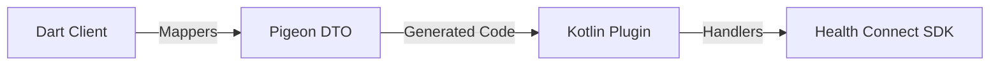

# CLAUDE.md

This file provides guidance to Claude Code (claude.ai/code) when working with code in this repository.

## Package Overview

This is `health_connector_hc_android`, the Android Health Connect platform implementation for the Health Connector
plugin (Dart + Pigeon). It bridges Flutter/Dart code to Android's Health Connect SDK via Pigeon-generated
type-safe platform channels.

For native Kotlin/Health Connect details, see the [Android native CLAUDE.md](packages/health_connector_hc_android/android/CLAUDE.md).

## Directory Structure

```text
android/       # Native Kotlin (see android/CLAUDE.md)
lib/           # Dart layer: client, mappers, pigeon *.g.dart
pigeon/        # Pigeon API definition and generated inputs
test/          # Dart unit tests (test/unit_tests/)
example/       # Example Flutter app
```

## Package Commands

From this package directory:

```bash
# Run Dart tests
fvm flutter test
fvm flutter test test/unit_tests/path_test.dart  # Single file

# Regenerate Pigeon code (from monorepo root)
melos run pigeon
```

## Package Architecture

### Dart Layer (`lib/`)

```text
lib/
├── health_connector_hc_android.dart    # Public exports
└── src/
    ├── health_connector_hc_client.dart # Main client implementing HealthConnectorPlatformClient
    ├── mappers/                         # Dart ↔ Pigeon DTO converters
    │   ├── health_record_mappers/       # Per-record-type mappers (steps, heart_rate, etc.)
    │   ├── permission_mappers/          # Permission request/status mappers
    │   └── request_and_response_mappers/ # API request/response mappers
    └── pigeon/
        └── *.g.dart                     # Generated Pigeon code (DO NOT EDIT)
```

### Data Flow



## Key Patterns

### Mapper Pattern

Bidirectional mappers exist in both Dart and Kotlin layers. On the Dart side:

- **Dart**: `lib/src/mappers/` - Convert domain models ↔ Pigeon DTOs

## Adding New Health Data Types

1. Define DTOs in `pigeon/health_connector_hc_android_api.dart`
2. Run `melos run pigeon` to regenerate
3. Create Dart mapper in `lib/src/mappers/health_record_mappers/`

## Testing

- Dart tests are located in `test/unit_tests/`
- Uses `mocktail` for mocking and `parameterized_test` for data-driven tests
- Mock the Pigeon API via `HealthConnectorHCClient.platformClient` setter
