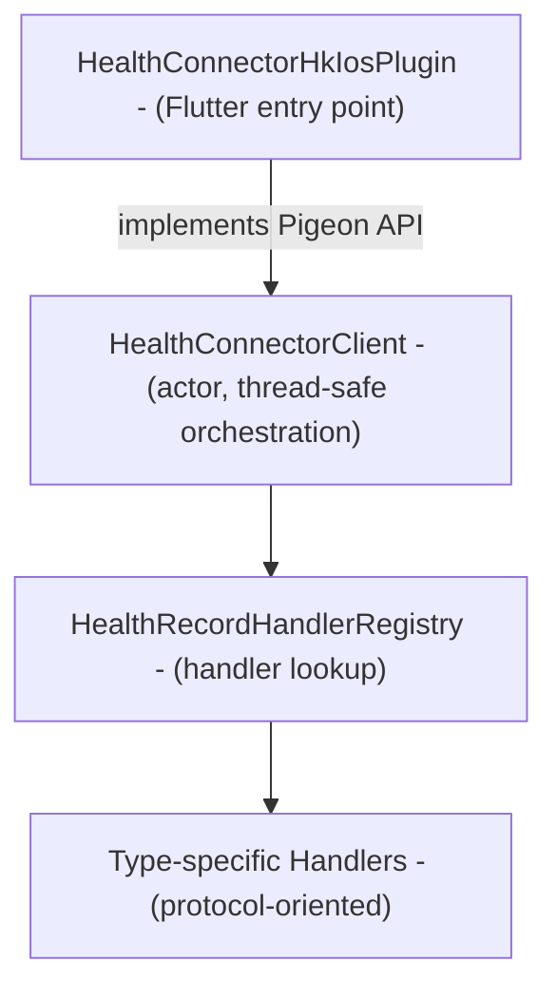

# CLAUDE.md

This file provides guidance to Claude Code (claude.ai/code) when working with code in this repository.

## Package Overview

This is the iOS (HealthKit) implementation of the Health Connector plugin. It's a Swift Package that bridges Flutter 
to HealthKit via Pigeon-generated code.

## Essential Commands

Run from the monorepo root unless noted otherwise.

```bash
# Swift analysis and formatting
melos run analyze:swift           # SwiftLint with baseline
melos run format:swift            # SwiftFormat

# Run Swift Package tests (from this directory)
swift test                        # Run all tests
swift test --filter TestName      # Run specific test

# Regenerate Pigeon code after changing pigeon/health_connector_hk_ios_api.dart
melos run pigeon
```

## Architecture

### Directory structure

```text
HealthConnectorHkIosPlugin.swift  # Flutter plugin entry point, implements Pigeon API
HealthConnectorClient.swift       # Actor wrapping HKHealthStore, orchestrates handlers
handlers/
├── HealthRecordHandler.swift    # Protocol for all health data handlers
├── AggregatableHealthRecordHandler.swift
└── health_record_handlers/     # One handler per health data type (Steps, HeartRate, etc.)
mappers/                         # DTO ↔ HealthKit type conversions
services/                        # Permissions, sync
errors/                          # HealthConnectorError enum
pigeon/                          # *.g.swift (generated, do not edit)
```

### Layer Structure



### Key Architectural Patterns

**Handler Protocol Composition**: Each health data type has a handler that conforms to capability protocols:

- `ReadableHealthRecordHandler` - read operations
- `WritableHealthRecordHandler` - write operations
- `DeletableHealthRecordHandler` - delete operations
- `AggregatableQuantityHealthRecordHandler` - aggregation (sum, avg, min, max)

Example (`StepsHandler.swift`):

```swift
final class StepsHandler: @unchecked Sendable,
    ReadableHealthRecordHandler,
    WritableHealthRecordHandler,
    DeletableHealthRecordHandler,
    AggregatableQuantityHealthRecordHandler { ... }
```

**Actor-based Concurrency**: `HealthConnectorClient` is a Swift actor providing compiler-enforced serial access to 
HealthKit. Pigeon completion handlers must dispatch to main thread via `complete(_:with:)`.

**Centralized Handler Registry**: `HealthRecordHandlerRegistry` maps `HealthDataTypeDto` enum cases to handler 
instances. Add new handlers in `registerAllHandlers()`.

## Adding a New Health Data Type

1. Create handler in `handlers/health_record_handlers/` implementing required capability protocols
2. Register in `HealthRecordHandlerRegistry.registerAllHandlers()`
3. Add DTO mapper in `mappers/health_record_mappers/`
4. Add HKSampleType mapping in `mappers/HealthDataTypeMapper.swift`

## Lint Configuration

- **SwiftLint**: Strict mode with baseline (`swiftlint-baseline.json`), excludes `*.g.swift`
- **SwiftFormat**: 4-space indent, 120 char max width, trailing commas always

Key SwiftLint rules: `force_unwrapping: warning`, `cyclomatic_complexity: 10/15`, `function_body_length: 100/200`

## Thread Safety Notes

- `HealthConnectorClient` is an actor - all methods are thread-isolated
- `HealthRecordHandlerRegistry` uses `NSLock` for thread-safe initialization (Mutex requires iOS 18+)
- Pigeon completion handlers must call `complete(_:with:)` to dispatch to main thread, otherwise `EXC_BAD_ACCESS` crashes occur

## iOS-Specific Notes

- **Minimum iOS 15.0**: Required for native Swift concurrency support.
- **HealthKit Privacy**: Read permission status always returns `unknown` due to iOS privacy restrictions.
- **Required Info.plist keys**: `NSHealthShareUsageDescription`, `NSHealthUpdateUsageDescription`
- **Swift Package Manager**: Uses `Package.swift` for native dependencies.
