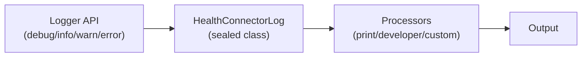

# CLAUDE.md

This file provides guidance to Claude Code (claude.ai/code) when working with code in this repository.

## Package Overview

`health_connector_logger` is an internal logging utility package that provides structured logging
capabilities across the Health Connector plugin ecosystem. It is NOT part of the public API and
should only be used within Health Connector packages.

## Directory Structure

```text
lib/
├── health_connector_logger.dart   # Public exports
└── src/
    ├── health_connector_logger.dart
    ├── log_processors/            # PrintLogProcessor, DeveloperLogProcessor
    ├── models/                    # HealthConnectorLog, log level, config
    └── utils/                     # Formatter, logger extension
test/
├── unit_tests/src/                # Mirrors lib/src structure
└── utils/                         # date_time_parser, test helpers
```

## Architecture

### Processor-Based Logging

The logger follows a **processor pattern** where log events flow through registered processors:



- **HealthConnectorLogger**: Singleton that dispatches logs to processors
- **HealthConnectorLog**: Sealed class hierarchy (DartLog vs NativeLog)
- **HealthConnectorLogProcessor**: Abstract base for custom processors
- **Built-in Processors**: `PrintLogProcessor`, `DeveloperLogProcessor`

### Log Types

- **HealthConnectorDartLog**: Logs from Dart code
- **HealthConnectorNativeLog**: Logs from native platforms (iOS/Android), includes `platform` field

## Essential Commands

### Running Tests

```bash
fvm flutter test                                                                     # All tests in package
fvm flutter test test/unit_tests/src/utils/                                          # Specific directory
fvm flutter test test/unit_tests/src/utils/health_connector_log_formatter_test.dart  # Single file
```

### Code Quality

```bash
fvm dart analyze                                      # Analyze code
fvm dart format .                                     # Format code
fvm dart format --output=none --set-exit-if-changed . # Check formatting
```

## Testing Patterns

- Tests use standard `test` package with `group()` and `test()`
- Test files mirror source structure: `test/unit_tests/src/` → `lib/src/`
- Test utilities in `test/utils/` (e.g., `date_time_parser.dart` for parsing formatted dates)
- Fixed DateTime values for predictable output in tests
- Comprehensive edge case coverage (empty values, nested structures, special characters)

## Key Implementation Details

### Processor Lifecycle

1. Logger creates `HealthConnectorLog` event
2. Dispatches to all registered processors via `internalLog()`
3. Each processor checks `shouldProcess()` (filters by log level)
4. Processor's `process()` method handles the log (fire-and-forget, non-blocking)

### Error Handling in Processors

Processors must NEVER throw exceptions from `process()`. Use try-catch and log errors to stderr:

```dart
@override
Future<void> process(HealthConnectorLog log) async {
  try {
    // Process log
  } on Exception catch (e, stackTrace) {
    stderr.writeln('ProcessorName error: Failed to process log: $e\n$stackTrace');
  }
}
```

## Design Constraints

- **Internal Use Only**: Not exposed in public API, marked with `@internal`, `@nodoc`
- **Non-Blocking**: Log processing uses `unawaited()` to avoid blocking
- **Immutable**: Log records are immutable value objects
- **Extensible**: Custom processors can be added via `addProcessor()`
- **Platform-Aware**: Distinguishes Dart vs native logs with sealed class hierarchy
